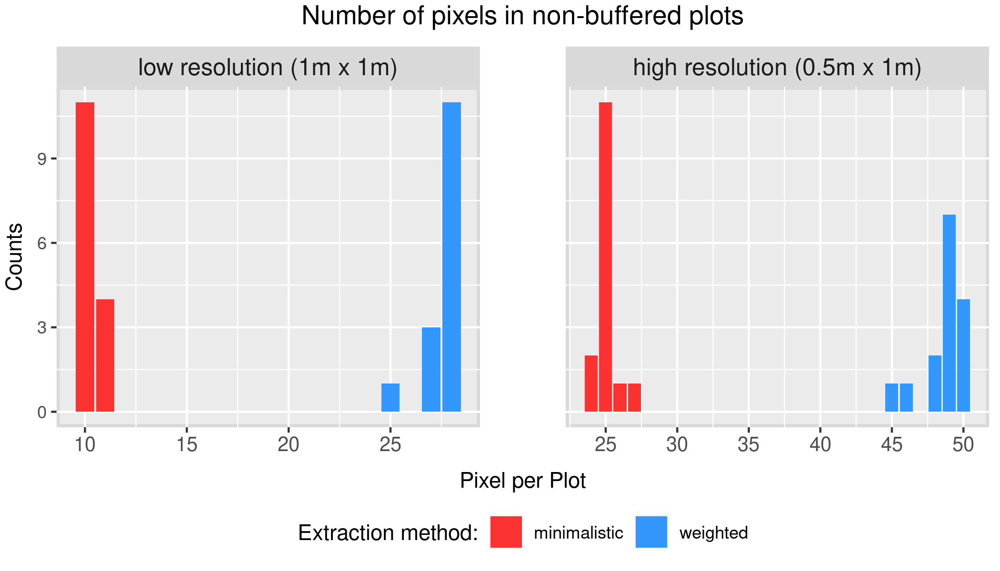
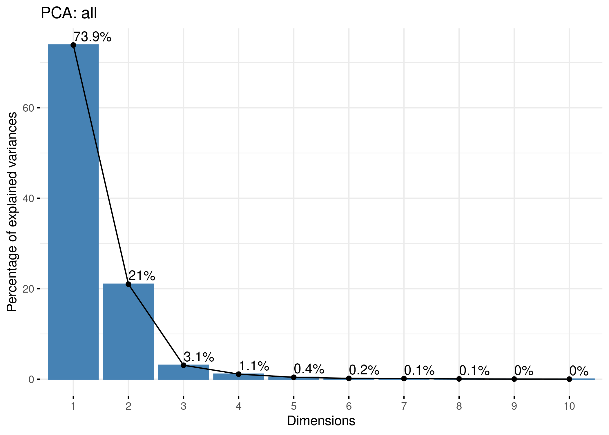
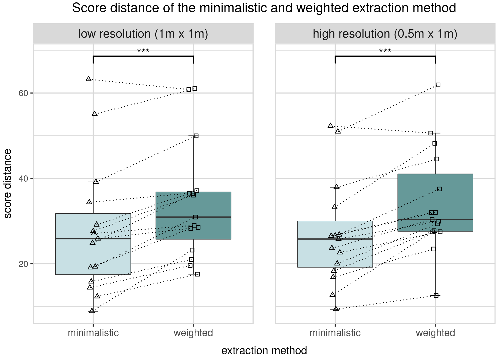
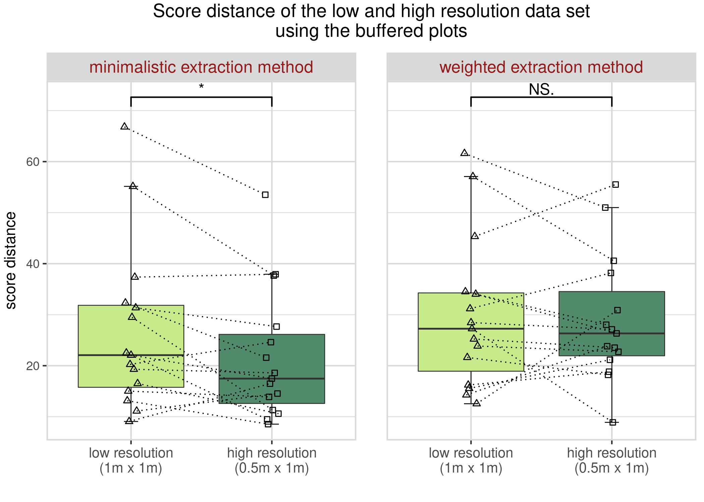

<!-- # ```{css, echo=FALSE} -->
<!-- # body .main-container { -->
<!-- #   max-width: 100% !important; -->
<!-- #   width: 100% !important; -->
<!-- #   margin-left: auto; -->
<!-- #   margin-right: auto; -->
<!-- # } -->
<!-- # body { -->
<!-- #   max-width: 100% !important; -->
<!-- #   margin-left: auto; -->
<!-- #   margin-right: auto; -->
<!-- # } -->
<!-- # ``` -->

<script src="layout/hideOutput.js"></script>

```{r setup, include=FALSE}
library(knitr)
knitr::opts_chunk$set(echo = TRUE, eval = TRUE, results = 'hide', message = FALSE, cache = TRUE)
```

```{r add_R_bib, include=FALSE}
knitr::write_bib(c(.packages(), 'knitr', 'ggplot2', 'tidyverse', 'raster', 'sf', 'ggpubr', 'stringr', 'hyperSpec', 'lubridate', 'readxl', 'factoextra', 'ggsignif'), 'bib/packages.bib')
```
---
nocite: '@*'
---

# Project report

## Introduction
<div>

  <div class="figure" style="float:right;width:40%;height:40%;font-size:12px;" display="inline-block">
  <span style="display:block;" id="breeding"></span>
  
  <figcaption class="figure-caption text-left">
  figure 1.1.1: Large scale plant breeding.
  </figcaption>
  </div>

  <p>
  Hyperspectral imaging is used in a wide range of fields today. It is used for quality control in drug production in medicine, for crime scene analysis in forensics or for examining the viability of seeds in agriculture, to name just a few examples.
  </p>
  
  <p>
  In our group project, we are looking at the use case in plant breeding. One might ask why hyperspectral imaging is of such great importance for plant breeding. The first aspect is the large sample size you need to get meaningful data. Let's say you want to study about a thousand plots with 30 to 100 plants per plot.  (fig. <a href="#breeding">1.1.1</a>)
  </p>
  
  <p>
  Now you want to examine each plot for its reflectance in the morning, afternoon and evening. This would require specialized equipment such as the Field Snake (<a href="#fieldsnake">fig. 1.1.2</a>) or Fieldcop (<a href="#fieldcop">fig. 1.1.3</a>), which are excellent for measurements, but are very time intensive and need to be calibrated for variations between different plant species, e.g. different growth heights or plot sizes. Taking hyperspectral images during overflights with an aircraft eliminates the need to calibrate for different plant species, requires much less time to measure a larger area and has less impact on the test site. The data we are using is geo-referenced, so every measurement can be allocated to a location in the real world. The referenced data still needs to be geo-rectified, as the aircraft is not completely stable. This means that the measurements are orientated and assigned to a grid. 
  </p>
  
  <p>
  One disadvantage of using airborne imaging, or long range sensors for that matter, is the spectral distortion caused by the atmosphere between the sensor and the object. This noise can afterwards be reduced by atmospheric measurements taken temporal close to the overflights and by correction models. Another point for discussion might be the geo-rectification, as the "nearest neighbor" approach for assigning measurements to pixels was used. It assigns a the closest measurement to the nearest pixel. The benefit is, that only real, measured data gets assigned, but it could distort the image a little, if the nearest data is relatively far away.
  </p>
  
  <div class="figure" style="float:left;width:75%;height:75%;font-size:12px;" display="inline-block;">
  <span style="display:block;" id="fieldsnake"></span>
  
  <figcaption class="figure-caption text-left">
  figure 1.1.2: [Field snake](https://ictagrifood.eu/sites/default/files/deliverables/CKA%20Kurzvorstellung%20BLE%2020.11.2019%20engl%20%28002%29.pdf).
  </figcaption>
  </div>
  <div class="figure" style="width:50%;height:50%;font-size:12px;">
  <span id="fieldcop"></span>
  
  <figcaption class="figure-caption text-left">
  figure 1.1.3: [Fieldcop](https://www.fz-juelich.de/ibg/ibg-2/EN/methods_jppc/FieldCop/_node.html).
  </figcaption>
  </div>

</div>
\ 

### HyPlant 

<div>

  <div class="figure" style="float:right;width:33%;height:33%;font-size:12px;" display="inline-block">
  <span style="display:block;" id="aircraft"></span>
  
  <figcaption class="figure-caption text-left">
  figure 1.2.1: HyPlant aircraft and interior.
  </figcaption>
  </div>

  <p>
  The [HyPlant aircraft](https://www.fz-juelich.de/ibg/ibg-2/EN/methods_jppc/HyPlant/_node.html) (<a href="#aircraft">fig. 1.2.1</a>) is an example of such an "airborne imaging spectrometer for vegetation monitoring", and the data obtained with it is the subject of the following project report.
  </p>
  <p>
  It consists of two hyperspectral modules in a single housing, the DUAL and the FLUO module (<a href="#module">fig. 1.2.2</a>). The DUAL module, which we chose as the source for our images, has two sensors with a spectral range of 370 - 2500 nm. The first sensor has a spectral resolution of 3 - 10 nm in the VIS/NIR range and the second sensor has a resolution of 10 nm in the SWIR range.
  </p>
  <p>
  The second module (FLUO) is used to detect the fluorescence of plants. It has to be much more accurate to detect narrow peaks in the relevant spectral range. Therefore, it was built to measure with a resolution of 0.25 nm and a much smaller range of 670 - 780 nm.
  </p>
  <p>
  We decided to work with the data from the DUAL module as it was already atmospherically corrected. The data set also contained two different overflights at different altitudes. 
  </p>
  
  <div class="figure" style="float:right;width:25%;height:25%;font-size:12px;" display="inline-block">
  <span style="display:block;" id="module"></span>
  
  <figcaption class="figure-caption text-left">
  fig. 1.2.2: HyPlant sensor (bottom view).
  </figcaption>
  </div>
  
  <p>
  The first overflight took place at 12:29 at an altitude of 600 metres, the second at 12:42 at 350 metres. The lower overflight has a higher resolution, so from now on the overflights will be referred to as "high resolution" and "low resolution" (<a href="#high-low">fig. 1.2.3</a>).
  </p>
  <p>
The main aspects of our project work are the implementation and usability of the R script. We investigated different ways to read, convert and analyse hyperspectral images, with the different ways to filter the image for relevant pixels. We called the different methods the "weighted method" and the "minimalist method". Furthermore, we have changed the pre-defined shapefile to also consider buffered plot borders.
  </p>

So at this point we have three different effects:

* Two different resolutions, resulting from the varying altitudes of the overflights,
* two different plot borders, the buffered and unbuffered and
* two different extraction methods, the minimalistic and weighted.

These effects result in eight data sets, which will be analysed in following chapters and compared in terms of accuracy.  The accuracy is based on the deviation from the ground measurements taken with the FloX module. The ground measurements was chosen as the reference, since they should have the least amount of noise. This is the case, because there was not a lot of space between the sensor and the object, causing spectral distortions.
\ 
  <div class="figure" style="width:70%;height:70%;font-size:12px;">
  <span style="display:block;" id="high-low"></span>
  
  <figcaption class="figure-caption text-left">
  fig. 1.2.3: High and low resolution data sets, with unbuffered (black) and buffered (red) plot borders
  </figcaption>
  </div>

  <br clear="right"/>
</div>
\ 

## Method

### Extraction methods

<div>
  <p>
  The weighted and minimalistic method we created differ in the amount of extracted pixels.
  
  In more detail this means, that the weighted method extracts pixels that are at least with their centroid (centre point of the pixel) inside the plot border. While creating an average for the respective plot, it weights the pixels reflection information by the amount of pixel area inside the plot borders. This is meant to counter for the influence of pixels near the plot boundaries, which could contain reflection data from outside the plot, while still keeping the highest number of relevant pixels.
  
  The minimalistic method extracts only pixels that are completely inside the plot. Our idea was to minimize the border effect as much as possible. A problem could be, that too many pixels are excluded through this harsh filter and one might argue that we won’t have enough data to make justified statements. But, considering the worst case, we still get <a href="#pixelcountbuffered">four pixels</a> at the bare minimum. We deemed this method as viable, since each pixel covers an area of one square meter and plants near the borders would be excluded from analysis any way.
  
  <div class="figure" style="font-size:12px;">
  <span style="display:block;" id="high-low"></span>
  
  <figcaption class="figure-caption text-left">
  fig. 2.1.1: Weighted marked with the red star (centroid) and minimalistic pixel extraction methods (whole pixel inside).
  </figcaption>
  </div>
  <br>
  
  Since the weighted method doesn’t have a counter for the border effects, we
  created the second shapefile representing buffered plot borders. The 30 cm buffer 
  zone is applied to all plot boundaries, which results in new plot areas of 
  2.4 x 5.4 meters. This reduces the inclusion of non-representative pixels using 
  the weighted method and reduces the pixel count we can expect for the 
  minimalistic method to at least four, which was still deemed enough. 
  <br><br>

  <div class="figure" style="margin-left:auto;margin-right:auto;width:85%;height:85%;font-size:12px;">
  <span style="display:block;" id="pixelcount"></span>
  
  <figcaption class="figure-caption text-left">
  fig. 2.1.2: Pixel count per plot, resolution and extraction method, \n using the unbuffered plot borders.
  </figcaption>
  </div>
  <br>
  <div class="figure" style="margin-left:auto;margin-right:auto;width:85%;height:85%;font-size:12px;">
  <span style="display:block;" id="pixelcountbuffered"></span>
  
  <figcaption class="figure-caption text-left">
  fig. 2.1.3: Pixel count per plot, resolution and extraction method, \n using the buffered plot borders.
  </figcaption>
  </div>

  <br clear="right"/>
</div>
\ 


### Preparations


Now we know which pixels we are extracting, using the different methods on the data sets resulting from the different resolutions and plot boundaries. The next step is to create and apply a uniform format for all the data sets. This includes filtering for comparable data and resampling the spectrum ranges to the same spectral range and accuracy. The resampling is done through the <a href="https://cran.r-project.org/web/packages/hyperSpec/hyperSpec.pdf">`hyperSpec`</a> package. It uses a mix of interpolation and smoothing to create values for the new, desired wavelength range. We chose a range of 390 nm to 940 nm with 1 nm steps, as this range is covered by both the FloX data and the DUAL data.
 
  <br>
  <div class="figure" style="float:right;width:51%;height:51%;font-size:12px;" display="inline-block">
  <span style="display:block;" id="resamplingexample"></span>
  
  <figcaption class="figure-caption text-left">
  fig. 2.2.2: Resampled FloX data. 
  </figcaption>
  </div>
  
  <div class="figure" style="width:40%;height:40%;font-size:12px;">
  <span id="resampling"></span>
  
  <figcaption class="figure-caption text-left">
  fig. 2.2.1: Wavelength range before and after resampling.
  </figcaption>
  </div>
  <br>

After all the transmutations of our data sets, they are now uniform and ready to be analysed.


We want to find out which method, in combination with the resolution and varying plot borders, is the closest to the actual ground measurements. For this purpose we want to consider all of our dimensions, such as the reflectance data for the different plots and each of the 550 wavelengths. We decided to do a principal component analysis (PCA), since this process would be extremely time consuming and heavy on the computational side, if done individually. 

\ 

### Principal Component Analysis

To compare these multi-dimensional data with typical statistical methods, the dimensions need to be reduced somehow. And as we want to compare different methods, we need a metric to describe the quality of the measurement as a single number. 

To achieve the dimension reduction, we used a principle component analysis (PCA). This analysis reduces multidimensional data by creating new dimensions, based on the eigenvectors of the covariance matrix, to explain as much variability with one dimension as possible. Every new dimension is orthogonal and linearly uncorrelated to the ones before. This commonly used approach typically projects most of the data points onto the first few principle components while preserving around ~95% of the data variation with the first two. As to be seen in the visualization of the eigenvalues (<a href="#eigenvalues">fig. 2.3.1</a>), this percentage is reached here as well.
<br>
<div class="figure" style="font-size:12px;">
<span id="eigenvalues"></span>

<figcaption class="figure-caption text-left">
fig. 2.3.1: Eigenvalues of the PCA including data sets of the reference, both methods and resolutions.
</figcaption>
</div>
<br>
Due to the nature of a PCA, to change the axis of the data sets, all data points we want to compare have to be within one data set. This combined data is easy to create with the resampled data sets. But this also prevents direct comparison between another PCA, even if calculated the same way. Another drawback of PCA is its sensitivity to outliers. This is of no concern here, as we already averaged all extracted pixels from each plot and thus should have a robust representation for each plot. 

To get a rough overview of the data within the new coordinate system based on the first two principle components, the individual data points where plotted in <a href="#individuals">fig. 2.3.2</a>. The FloX data is represented by the red data points and represents the reference value of a plot, which the different extraction method should replicate. The metric on how close the different methods are in representing the reference value is calculated by the euclidean distance between the two data points. This calculated value is the so called score distance.
<br>
<div class="figure" style="font-size:12px;">
<span id="individuals"></span>

<figcaption class="figure-caption text-left">
fig. 2.3.2: Individuals of the PCA including data sets of the reference, both methods and resolutions.
</figcaption>
</div>
<br>
The data is then separated back into the corresponding data set (combination of extraction method and resolution) and tested for normality using a Shapiro-Wilk test. The Null-hypothesis had to be rejected for some data sets while most of the data sets where close around the alpha level of 0.05. Thus we didn’t used the students t-test but the Wilcoxon signed-rank test, which is a non-parametric statistical hypothesis test. As we look at the same measurement using different methods, this test is a paired difference test.

To compare the different methods, we test whether one variant has a lower score distance than the other one. It was tested, if the minimalistic method had a significant lower score distance than the weighted extraction method at both resolutions and if the higher resolution has a significant lower score distance than the low resolution data for each extraction method. The same test was applied to buffered data sets. The last test checked whether the buffered plots had a significant lower score distance than the non-buffered version, tested separately for each extraction method and resolution.
\ 

## Results {.tabset}

### Unbuffered data set

The first comparison is between the two extraction methods at different resolutions with the non-buffered data set. This can be considered the worst case for the weighted extraction method, as it includes pixels that are partially outside the plot. At the same time the minimalistic extraction method does only includes pixels completely inside, which is some kind of a buffer itself. Thus, in this scenario the difference in the score distance between the both extraction method is highly significant in at both resolutions, with the minimalistic method being closer to the reference value produced by FloX. One can see the clear trend by lines indicating the pairwise comparison.

<!-- <a href="#method-unbuff">test</a> -->
<div class="figure" style="font-size:12px;font-style:italic">
<span id="method-unbuff"></span>

<figcaption class="figure-caption text-left">
fig. 3.1.1: Comparison of the minimalistic and weighted extraction methods by using the score distance from FloX to each of the extraction methods of the coordinates of the first two principal components. Separated between the low and high resolution data set. Paired one-sided Wilcoxon test, n = 15, p.value: * < 0.05, ** < 0.01, *** < 0.001 .
</figcaption>
</div>
\ 

Using the high resolution (0.5 m x 1 m) data set instead of the low resolution (1 m x 1 m) data set does not improve the score distance for neither extraction method using the non-buffered plots. The score distance of the same points is sometimes bigger or smaller than its counterpart in the other data set. No clear Trend can be seen nor calculated. It is irrelevant which resolution we use regardless of the extraction method, when using the non-buffered plots.

<div class="figure" style="font-size:12px;font-style:italic">
<span id="res-unbuff"></span>

<figcaption class="figure-caption text-left">
fig. 3.1.2: Comparison of the low and high resolution data sets by using the score distance from FloX to each of the resolutions with the coordinates of the first two principal components. Separated between the minimalistic and weighted extraction method. Paired one-sided Wilcoxon test, n = 15, p.value: * < 0.05, ** < 0.01, *** < 0.001 .
</figcaption>
</div>

\ 

### Buffered data set

With the buffered plots the improvement of the minimalistic extraction method diminishes, at least with the low resolution (1 m x 1 m) data set. With a p-value of 0.019 one can only see a slight significant difference between the two extraction methods using a paired one-sided Wilcoxon test. Using the high resolution (0.5 m x 1 m) data set on the other hand greatly improves the score distance of the  minimalistic extraction method in comparison to the weighted extraction method. With a p-value of 0.00035 and a clear visual difference this is a great improvement. The minimalistic method also led to the lowest average score distance of any combination of data sets.

<div class="figure" style="font-size:12px;font-style:italic">
<span id="method-buff"></span>

<figcaption class="figure-caption text-left">
fig. 3.2.1: Comparison of the minimalistic and weighted extraction methods by using the score distance from FloX to each of the extraction methods of the coordinates of the first two principal components. Separated between the low and high resolution data set using the buffered plots. Paired one-sided Wilcoxon test, n = 15, p.value: * < 0.05, ** < 0.01, *** < 0.001 .
</figcaption>
</div>
\ 

Checking on a significant improvement of the high resolution (0.5 m x 1 m) data set over the lower one (1 m x 1 m) we can confirm, with a p-value of 0.012, a slightly positive reduction of the score distance with the minimalistic extraction method. The weighted extraction method does not show a significant reduction in score distance using the higher resolution data set and the buffered plots.

<div class="figure" style="font-size:12px;font-style:italic">
<span id="res-buff"></span>

<figcaption class="figure-caption text-left">
fig. 3.2.2: Comparison of the low and high resolution data sets by using the score distance from FloX to each of the resolutions with the coordinates of the first two principal components. Separated between the minimalistic and weighted extraction method using the buffered plots. Paired one-sided Wilcoxon test, n = 15, p.value: * < 0.05, ** < 0.01, *** < 0.001 .
</figcaption>
</div>

\ 

### Unbuffered vs. buffered

Using the buffered instead of the non-buffered plots reduced the score distance significantly for the weighted extraction method regardless of which resolution set was being used. For the minimalistic extraction method there was no significant improvement using buffered data with the low resolution data set.

<div class="figure" style="font-size:12px;font-style:italic">
<span id="low-buff-non"></span>

<figcaption class="figure-caption text-left">
fig. 3.3.1: Comparison of the non-buffered and buffered plots by using the score distance from FloX to each of the non-buffered and buffered plots with the coordinates of the first two principal components. Separated between the minimalistic and weighted extraction method using the low resolution data set. Paired one-sided Wilcoxon test, n = 15, p.value: * < 0.05, ** < 0.01, *** < 0.001 .
</figcaption>
</div>
\ 

Using the high resolution data set on the other hand still let to a significant reduction of score distance even for the minimalistic extraction method. With the high resolution data set the score distance was always significantly improved by using the buffered plots. 

<div class="figure" style="font-size:12px;font-style:italic">
<span id="high-buff-non"></span>

<figcaption class="figure-caption text-left">
fig. 3.3.2: Comparison of the non-buffered and buffered plots by using the score distance from FloX to each of the non-buffered and buffered plots with the coordinates of the first two principal components. Separated between the minimalistic and weighted extraction method using the high resolution data set. Paired one-sided Wilcoxon test, n = 15, p.value: * < 0.05, ** < 0.01, *** < 0.001 .
</figcaption>
</div>

\ 


## Discussion

After seeing the results it is clear, that the best score distance was achieved with the minimalistic extraction method and the high resolution (0.5 m x 1 m) data set using the buffered plots. The minimalistic extraction method outperformed the weighted extraction method in the non-buffered plots. This was also not surprising, as the weighted method always contains pixel along the border of the plot, which can potentially - and often does - include information from measuring points outside the original plot, but due to the geo-rectification are now located on - or at least with their centroid within - the plots. The minimalistic extraction method circumvents this problem by having a “natural” created one in the form of the size of the pixel. 

This “natural” buffer of the minimalistic extraction method on the other hand leads to way less pixels left for the calculation, which can increase the variability of the data and thus make the results less reliable. This problem becomes even more severe, if we use the buffered plots, as even less pixels are now available. In fact, checking the normality of the calculated score distance using the buffered plots, we found out, that while the weighted extraction method results in barely normally distributed data, in the minimalistic extraction method we have to reject the null hypothesis of the data being normally distributed in our Shapiro-Wilk test. This additional variability due small sample size is something to be aware of when using this extraction method.

When using no additional buffer on the plots, there was no improvement of the high resolution data in comparison to the low resolution data for neither method as to be seen in <a href="#res-unbuff">fig. 3.1.2</a>. This was a little bit surprising, as we assumed a higher pixel count would be especially better for the weighted extraction method, as more non-weighted pixels are introduced in the centre of the plot. But instead, doing a visual inspection of the graph, the opposite even seems to be the case. We could only explain this behaviour with both effects of additional pixel close to the border introducing as much error as the additional pixels at the centre of the plots dampening these various errors. For the weighted method the introduced error seems a little bit higher than the additional gain of the pixels in the centre.

We have now established that the weighted method needs a buffer for a fair comparison, so we repeated the previous test in the same manner on the now buffered plots. This reduction of usable area for our calculation starts to become a problem for the minimalistic extraction method. As mentioned earlier and to be seen in the <a href="#pixelcount">pixel count plot</a>, the number of pixels per plot in the low resolution data set, being used for calculation, is reduce to four usable data points. Because of this rather hard limitation, the score distance is starting to become less of a difference between both methods for the low resolution data set (<a href="#results">fig. 3.2.1</a>), even though we could still show a slight but significant improvement using the minimalistic extraction method. Increasing the buffer further could result in no data for these plots and thus is not advised for the minimalistic extraction method. For the high resolution data set, in this plot, the lack of pixels in the minimalistic extraction method is no more and it can again significantly reduce the score distance in comparison to the other method. This suggests, that for every resolution and plot size an optimum balance between the size of the buffer and number of pixels can be found, mainly dictated by a minimum of pixels being required. To validate this concluding assumption, the number of required pixels, which is probably dependent on the quality of the sensor. This could be determined by dynamically adjusting the buffer during the calculation and correlating the distance score of the results against the used pixel count. 

The comparison between the low and high resolution data sets using the buffered plots again did not improved the weighted extraction method, but surprisingly improved the minimalistic extraction method significantly (<a href="#results">fig. 3.2.2</a>). This supports the previous conclusion, that the minimalistic extraction method is limited by the number of pixels and shows it full potential when given more data points. The weighted extraction method does not seem to use the additional information. This might me be due to the buffer still not being small enough to completely out rule errors from pixels near the border of the plots.

In the last comparison between the non-buffered and buffered data using different extraction methods and resolution data sets, an improvement by using the buffered plots can be seen (<a href="#results">fig. 3.3.1</a>). In almost all cases the improvement was highly significant but for the minimalistic extraction method using the low resolution data set. This correspond to the previous findings, that the minimalistic method already contains a “natural” buffer, due to all pixels having to be completely inside the plot borders. Thus the minimalistic method does not improve using an additional buffer with the low resolution data sets. It would be still recommended to use a buffered data set anyway, as the distance score can still improve if the data has a higher resolution (<a href="#results">fig. 3.3.2</a>).  The weighted extraction method improved in both cases, as the nature of this method always includes pixels near the plot border. So with every buffer the percentage of pixels at the centre of the plot increases. To take this even further, a bigger buffer could even result in a equal distance score as achieved by the minimalistic extraction method. 

Looking at the results the similarities between both methods become obvious. It is possible that with the right buffer, the weighted method will catch up to the accuracy of the minimalistic extraction method. But the fundamental difference between these to methods its the minimalistic method is not weighting the pixels dependent on their coverage of the plot area. This makes all pixels equally important, as long as they are inside the plot. With the weighted method one could never achieve this, as even making the plot smaller, pixels completely inside the plot would be weighted based on their coverage of the strictly buffered area. To compensate the lack of pixels for the minimalistic extraction method one could also allow pixel that are mostly inside, such as covering 95% of the buffered plot area. 

Another problem was the geo-rectification. This process is especially important when trying to figure out if a pixel actually lies within a plot or not. As the “nearest neighbour” approach was chosen for the geo-rectification, it can happen, that pixels now inside the geo-rectified plot were originally measurement points covering mostly area outside the plots. This results in the need of only taking pixels as close to the centre of a plot as possible, which was shown by the improvements using buffered plots. So while improving the extraction method, using higher resolutions and buffering the data, there is also a potential of improvement by geo-rectify the measurements in a direction most suitable for the them and not facing the pixels strictly north. But this process starts way earlier in the processing pipe and thus was not tested in this project.

The distance score is also a important factor in this project, as it was the sole metric being used to qualify the results. It is quite arbitrary due to the nature of the principle component analysis (PCA), which rearranges the dimensions to reduce the variability explained by each. This leads to a loss of scale and only comparisons between data  sets in the same PCA can be made. While claiming a lower difference between the reference data set produced by the FloX measurements and the HyPlant measurements is logical, absolute differences always help to understand the dimension of the improvements and put everything into perspective. It is also worth to consider different approaches to calculate the distance between the coordinates resulting from the PCA. Using the “Manhattan distance”, the absolute sum of the differences in both directions, for example, one could normalize the distance measurement based on the percentage of explained variability in each dimension. The approach using a PCA should thus be revised to handle some of its shortcomings, but at the same time it was a straight forward and efficient way to handle such multi-dimensional data, which is always a challenging task.
\ 

## Conclusion
Overall the new minimalistic extraction method showed promising results over the normally used weighted approach. It preselects pixel that are completely inside the plot boundaries and thus only picks the most centred pixels. At both resolutions and using buffered or non-buffered data the minimalistic method was either equal or better than the weighted one. The minimalistic extraction method could improve with the high resolution data set and also by using a buffer. A drawback of the method is the higher possibility of not getting enough or any pixel at all as the rules to select pixels are more strict. 
The distance score is an interesting approach to reduce and calculate the hyperspectral data in an efficient way and seems to be reliable for such a comparison. It still can be further improved to account for the drawbacks that usually come with such dimension reduction, such as loss of absolute units for comparison or not being able to directly compare to results to different calculations.
A topic for further research could be the automatically calculated optimal balance between the number of pixels and size of the buffer zone. While the number of pixels should be as large as possible, at the same time pixels further out bear the higher risk of being influenced by information not within the plots. This balancing act might be universally calculable for a specific sensor.
\ 


# (APPENDIX) Appendix {-}

<!-- ## (PART) Part I {-} -->

## Reading in and cleaning

### Introduction {.tabset}

We made the code as universal as possible. This means that even if somebody wants to use the script for a different data set, there should only be a few little tweaks in the code needed.<br>
The sections that could need tweaking were marked with **“PTN”** (possible tweak needed). 
\ 

#### Required libraries

The first step in using the script, is loading all the necessary libraries. 
We split them in two sections. </br>
The <a href="#first-libs">first section</a> includes the libraries needed for 
reading the data and converting it. <br> The <a href="#analysis">second section</a> 
includes libraries needed for the analysis.

<div class = "fold s">
```{r first-libs}
library(raster)
library(sf)
library(ggpubr)
library(stringr)
library(hyperSpec)
library(lubridate)
library(tidyverse)
```
</div>
\ 

#### Starting a cluster (optional)

If you are lucky and have a powerful machine to work with, you can set the number of threads here.<br>
**WARNING:** If you do create a cluster, it is highly advised to close it again. <br>
**WARNING:** This is done after the <a href="#extraction-methods-1">pixel extraction</a> chapter, which is the last <br>
**WARNING:** part of the script that needs a lot of computation power.

More information on that <a href="">here</a>

<div class = "fold s">
```{r}
require(snow)
threads <- 7
beginCluster(n = threads)
rm(threads)
```
</div>
\ 

#### Necessary files

After loading all the mentioned libraries so far, we can start reading in the data.

The data extraction of raster files is easily done with the help of a few packages. The most important one is the `raster` package, which enables us to parse through the raster file and extract all pixel values within a polygon (or other shapes) provided by a [shapefile](https://en.wikipedia.org/wiki/Shapefile).

**PTN:** The shape files can be edited directly. You can create a buffer zone using the `dist` parameter of the `st_buffer` function. The example used here creates a 30 cm buffer zone. You need to activate the commented code to actually use the buffered version of the plots. After running the buffered version, all important data frames get exported and saved for later analysis.
We also set the unused “ID” column in the shape file data frame to the number of plots, so it can be used later on.


<div class = "fold s">
```{r}
# Radiance Raster
radiance_1229_600 <- brick("Erfassung_Phänotypen2021/HyPlant data/12_29/20180629-CKA-1229-600-L3-N-DUAL_radiance_img_surfrad-rect_subset.bsq")
radiance_1242_350 <- brick("Erfassung_Phänotypen2021/HyPlant data/12_42/20180629-CKA-1242-350-L2-E-DUAL_radiance_img_surfrad-rect_subset.bsq")

# Plots & Attributes
buffer = FALSE
plots_1229 <- st_read("Erfassung_Phänotypen2021/Shapefiles/Barley_1229.shp")
plots_1242 <- st_read("Erfassung_Phänotypen2021/Shapefiles/Barley_1242.shp")

# Creating a buffer for a second run
#buffer <- TRUE
#plots_1229 <- sf::st_buffer(plots_1229, dist = -0.3, endCapStyle = "SQUARE")
#write_sf(plots_1229, "Erfassung_Phänotypen2021/Shapefiles/Barley_1229_buffered_30_cm.shp")
#plots_1242 <- sf::st_buffer(plots_1242, dist = -0.3, endCapStyle = "SQUARE")
#write_sf(plots_1242, "Erfassung_Phänotypen2021/Shapefiles/Barley_1242_buffered_30_cm.shp")

# Assign ID
plots_1229 <- mutate(plots_1229, ID = seq(1:nrow(plots_1229)), .keep = "all")
plots_1242 <- mutate(plots_1242, ID = seq(1:nrow(plots_1242)), .keep = "all")
```
</div>
\ 

### Pixel extraction {.tabset}

#### Methods 

Now that we have the raster and shape files loaded, we can use the shape files to filter for the pixels we want to look at. We use the `extract` function for this purpose. The extraction method is also modified through the parameters of this function. <br><br>
**PTN:** In our case we used the `extract` function in two different ways. 
The first subset should include only pixels, that are completely inside the shape file boarders. For this we use the argument `normalizeWeights = FALSE` and `filter` for pixels with `weight == 1`.<br> 
The second subset should include every pixel with its centroid (centre point) inside the plot border. For this we use the argument `normalizeWeights = TRUE`. This also means that, when it comes to creating a mean reflection for the plot, the included pixels get weighted by their area inside the plot.

<div class = "fold s">
```{r}
## Extract pixel values from radiance map within the shape file
minimalistic_1229_raw <- raster::extract(radiance_1229_600, plots_1229, df = TRUE, weights = TRUE, normalizeWeights = FALSE)
minimalistic_1242_raw <- raster::extract(radiance_1242_350, plots_1242, df = TRUE, weights = TRUE, normalizeWeights = FALSE)
normal_1229_raw <- raster::extract(radiance_1229_600, plots_1229, df = TRUE, weights = TRUE, normalizeWeights = TRUE)
normal_1242_raw <- raster::extract(radiance_1242_350, plots_1242, df = TRUE, weights = TRUE, normalizeWeights = TRUE)

# Filter for weights == 1 (cells fully within), no filter for normal approach
minimalistic_1229_filtered <- filter(minimalistic_1229_raw, weight == 1)
minimalistic_1242_filtered <- filter(minimalistic_1242_raw, weight == 1)
normal_1229_filtered <- normal_1229_raw
normal_1242_filtered <- normal_1242_raw
```
</div>
<br>
At this point we have six different subsets of data.


* Two different extraction methods, 
* two different plot borders, the buffered and unbuffered and 
* two different resolutions, resulting from the varying altitudes of the overflights.


Comparing these subsets and their accuracy in displaying the ground measurements taken by the FloX module is the goal of this project work.
\ 

#### Closing Cluster (optional)

As mentioned <a href="#introduction-1">before</a>, one should always close the cluster aftre the heavy computational processes.

<div class = "fold s">
```{r}
endCluster()
```
</div>
\ 

#### Rename columns

The first step in cleaning our data and preparing it for the analysis is renaming the columns to the wavelength. There might be different naming conventions in the original data sets, which is why we filter for a pattern that describes the wavelength format.<br>
**PTN:** In our case the wavelength was divided by 1000. This resulted in this "[0-9][.][0-9]{6}" pattern, for example the wavelength 780.6743 would be 7.806743. You need to check the naming convention in your case and maybe adjust the Regex pattern. Since the wavelength was divided by 1000 for our case, we also multiplied by 1000 before changing the column names of the data sets.

<div class = "fold s">
```{r}
# Rename spectral columns to wavelength
# Rename minimalistic 1229
col_names_bands_1229_minimalistic <- head(colnames(minimalistic_1229_raw)[-1], -1)
# Adjust extraction pattern for pattern of the wavelength. 
# In this case it was divided by 1000, so a wavelength of 997.540 nm is represented as 0.997540 in the column name.
wavelength = "[0-9][.][0-9]{6}"
new_col_names_bands_1229_minimalistic <- as.character(format(as.numeric(str_extract(pattern = wavelength, col_names_bands_1229_minimalistic))*1000))
new_col_names_bands_1229_minimalistic <- append("ID", append(new_col_names_bands_1229_minimalistic, "weight"))
colnames(minimalistic_1229_filtered) <- new_col_names_bands_1229_minimalistic
# Rename minimalistic 1242
col_names_bands_1242_minimalistic <- head(colnames(minimalistic_1242_raw)[-1], -1)
wavelength = "[0-9][.][0-9]{6}"
new_col_names_bands_1242_minimalistic <- as.character(format(as.numeric(str_extract(pattern = wavelength, col_names_bands_1242_minimalistic))*1000))
new_col_names_bands_1242_minimalistic <- append("ID", append(new_col_names_bands_1242_minimalistic, "weight"))
colnames(minimalistic_1242_filtered) <- new_col_names_bands_1242_minimalistic
# Rename normal 1229
col_names_bands_1229_normal <- head(colnames(normal_1229_raw)[-1], -1)
wavelength = "[0-9][.][0-9]{6}"
new_col_names_bands_1229_normal <- as.character(format(as.numeric(str_extract(pattern = wavelength, col_names_bands_1229_normal))*1000))
new_col_names_bands_1229_normal <- append("ID", append(new_col_names_bands_1229_normal, "weight"))
colnames(normal_1229_filtered) <- new_col_names_bands_1229_normal
# Rename normal 1242
col_names_bands_1242_normal <- head(colnames(normal_1242_raw)[-1], -1)
wavelength = "[0-9][.][0-9]{6}"
new_col_names_bands_1242_normal <- as.character(format(as.numeric(str_extract(pattern = wavelength, col_names_bands_1242_normal))*1000))
new_col_names_bands_1242_normal <- append("ID", append(new_col_names_bands_1242_normal, "weight"))
colnames(normal_1242_filtered) <- new_col_names_bands_1242_normal
```
</div>
\ 

#### Aggregate Cell Data

The next steps are joining the raster image data and the plot data from the shapefile together. 

<div class = "fold s">
```{r}
# WARNING: Data is multiplied 1000 to transform float values to integer. This explains negative values.
# Join raster data and plot data
minimalistic_1229 <- left_join(minimalistic_1229_filtered, plots_1229, by = "ID")
minimalistic_1242 <- left_join(minimalistic_1242_filtered, plots_1242, by = "ID")
normal_1229 <- left_join(normal_1229_filtered, plots_1229, by = "ID")
normal_1242 <- left_join(normal_1242_filtered, plots_1242, by = "ID")

# Calculate mean for all pixels and spectral bands per plot
bands_mean_minimalistic_1229 <- mutate(minimalistic_1229, across(contains("."), ~ .x / 10))
bands_mean_minimalistic_1229 <- summarise(group_by(bands_mean_minimalistic_1229, PLOTID), across(contains("."), mean))
bands_mean_minimalistic_1242 <- mutate(minimalistic_1242, across(contains("."), ~ .x / 10))
bands_mean_minimalistic_1242 <- summarise(group_by(bands_mean_minimalistic_1242, PLOTID), across(contains("."), mean))
bands_mean_normal_1229 <- mutate(normal_1229, across(contains("."), ~ (.x/10)*weight))
bands_mean_normal_1229 <- summarise(group_by(bands_mean_normal_1229, PLOTID), across(contains("."), sum))
bands_mean_normal_1242 <- mutate(normal_1242, across(contains("."), ~ (.x/10)*weight))
bands_mean_normal_1242 <- summarise(group_by(bands_mean_normal_1242, PLOTID), across(contains("."), sum))

# Rejoin with attribute table of plots
minimalistic_1229_mean <- left_join(bands_mean_minimalistic_1229, plots_1229, by = "PLOTID")
minimalistic_1242_mean <- left_join(bands_mean_minimalistic_1242, plots_1242, by = "PLOTID")
normal_1229_mean <- left_join(bands_mean_normal_1229, plots_1229, by = "PLOTID")
normal_1242_mean <- left_join(bands_mean_normal_1242, plots_1242, by = "PLOTID")
```
</div>
\ 

### Preparations for the analysis {.tabset}

#### FloX data

This chapter involves the preparations of the FloX data. We read the data in, make adjustments regarding the timezone, filter for viable data points and create a mean for every plot.

We also build the FloX `hyperSpec` object and use it for resampling the data set. After the resampling we convert it back to a normal data frame.

<div class = "fold s">
```{r, results = 'markup', message=FALSE, warning=FALSE}
# Import FloX data
FloX <- read.csv("Erfassung_Phänotypen2021/FloX_FULL_Reflected_Radiance_180629_converted.csv", header = TRUE, check.names = FALSE)
FloX$`datetime [UTC]` <- as.POSIXct(FloX$`datetime [UTC]`, tz = "UTC")
FloX$`datetime [UTC]` <- with_tz(FloX$`datetime [UTC]`, "CET")
FloX <- rename(FloX, datetime = `datetime [UTC]`)
FloX$Plot <- as.numeric(as.character(FloX$Plot))

# Check for viable FloX data within +- 1h flight time.
viable_flox <- filter(select(FloX, datetime, Plot), Plot < 400 & Plot != "Soil")
viable_flox <- viable_flox[!duplicated(viable_flox$Plot),]

# Reducing FloX data to plots that meet the requirement
#viable_flox <- filter(viable_flox, datetime >= as.POSIXct("2018-06-29 11:37:00", tz = "CET") & 
#                        datetime <= as.POSIXct("2018-06-29 13:24:00", tz = "CET"))
FloX <- filter(FloX, Plot %in% viable_flox$Plot)

# Adjust scale and calculate mean for plots
FloX_mean <- mutate(FloX, across(contains("."), ~ .x/10))
FloX_mean <- summarise(group_by(FloX_mean, Plot), across(!c("doy.dayfract", "datetime"), mean))


# Creating hyperSpec Object, resample wavelengths and cutting data set at 390nm to 940nm
wavelength <- as.numeric(as.character(colnames(FloX_mean[-1])))
spectra.matrix <- as.matrix(select(FloX_mean, contains(".")))
extra.data <- as.matrix(select(FloX_mean, Plot))
spc_flox_raw <- new("hyperSpec", spc = spectra.matrix, wavelength = wavelength, data = data.frame(extra.data), labels = list(spc = expression(mu*W~cm^-2~sr^-1~mu*m^-1), .wavelength = "nm"))
spc_flox <- spc.loess(spc_flox_raw, seq(390, 940, 1)) # sequence of wavelength

# Transfrom hyperSpec back to data frame
spc_flox_df <- as.wide.df(spc_flox)
colnames(spc_flox_df) <- append("PlotID", as.character(seq(390, 940, 1)))
#spc_flox_df$PlotID <- paste0("flox_", as.character(spc_flox_df$PlotID)) 

```
</div>
\ 

#### HyPlant data

The preparation of the HyPlant data sets is similar to the preparation of the FloX data. We filter the data for overlaps with the FloX data (`viable_flox`) and create a `hyperSpec` object for each data set. After resampling the data sets we transform them back into normal data frames.

<div class = "fold s">
```{r}
# Filter data sets to only include plots that are also in the FloX data
bands_mean_minimalistic_1229 <- filter(bands_mean_minimalistic_1229, PLOTID %in% viable_flox$Plot)
bands_mean_minimalistic_1242 <- filter(bands_mean_minimalistic_1242, PLOTID %in% viable_flox$Plot)
bands_mean_normal_1229 <- filter(bands_mean_normal_1229, PLOTID %in% viable_flox$Plot)
bands_mean_normal_1242 <- filter(bands_mean_normal_1242, PLOTID %in% viable_flox$Plot)

# Creating hyperSpec Object, resample wavelengths and cutting data set at 390nm to 940nm
wavelength <- as.numeric(as.character(colnames(bands_mean_minimalistic_1229)[-1]))
spectra.matrix <- as.matrix(select(bands_mean_minimalistic_1229, contains(".")))
extra.data <- as.matrix(select(bands_mean_minimalistic_1229, PLOTID)) 
spc_1229_minimalistic_raw <-new("hyperSpec", spc = spectra.matrix, wavelength = wavelength, data = data.frame(extra.data), labels = list(spc = expression(mu*W~cm^-2~sr^-1~mu*m^-1), .wavelength = "nm"))
spc_1229_minimalistic <- spc.loess(spc_1229_minimalistic_raw, seq(390, 940, 1)) # sequence of wavelength

wavelength <- as.numeric(as.character(colnames(bands_mean_minimalistic_1242)[-1]))
spectra.matrix <- as.matrix(select(bands_mean_minimalistic_1242, contains(".")))
extra.data <- as.matrix(select(bands_mean_minimalistic_1242, PLOTID)) 
spc_1242_minimalistic_raw <-new("hyperSpec", spc = spectra.matrix, wavelength = wavelength, data = data.frame(extra.data), labels = list(spc = expression(mu*W~cm^-2~sr^-1~mu*m^-1), .wavelength = "nm"))
spc_1242_minimalistic <- spc.loess(spc_1242_minimalistic_raw, seq(390, 940, 1))

wavelength <- as.numeric(as.character(colnames(bands_mean_normal_1229)[-1]))
spectra.matrix <- as.matrix(select(bands_mean_normal_1229, contains(".")))
extra.data <- as.matrix(select(bands_mean_normal_1229, PLOTID)) 
spc_1229_normal_raw <-new("hyperSpec", spc = spectra.matrix, wavelength = wavelength, data = data.frame(extra.data), labels = list(spc = expression(mu*W~cm^-2~sr^-1~mu*m^-1), .wavelength = "nm"))
spc_1229_normal <- spc.loess(spc_1229_normal_raw, seq(390, 940, 1))

wavelength <- as.numeric(as.character(colnames(bands_mean_normal_1242)[-1]))
spectra.matrix <- as.matrix(select(bands_mean_normal_1242, contains(".")))
extra.data <- as.matrix(select(bands_mean_normal_1242, PLOTID)) 
spc_1242_normal_raw <-new("hyperSpec", spc = spectra.matrix, wavelength = wavelength, data = data.frame(extra.data), labels = list(spc = expression(mu*W~cm^-2~sr^-1~mu*m^-1), .wavelength = "nm"))
spc_1242_normal <- spc.loess(spc_1242_normal_raw, seq(390, 940, 1))

# Transform hyperSpec back to data frame
spc_1229_minimalistic_df <- as.wide.df(spc_1229_minimalistic)
colnames(spc_1229_minimalistic_df) <- append("PlotID", as.character(seq(390, 940, 1)))
#spc_1229_minimalistic_df$PlotID <- paste0("minimalistic_1229_", as.character(spc_1229_minimalistic_df$PlotID)) 

spc_1242_minimalistic_df <- as.wide.df(spc_1242_minimalistic)
colnames(spc_1242_minimalistic_df) <- append("PlotID", as.character(seq(390, 940, 1)))
#spc_1242_minimalistic_df$PlotID <- paste0("minimalistic_1242_", as.character(spc_1242_minimalistic_df$PlotID)) 

spc_1229_normal_df <- as.wide.df(spc_1229_normal)
colnames(spc_1229_normal_df) <- append("PlotID", as.character(seq(390, 940, 1)))
#spc_1229_normal_df$PlotID <- paste0("normal_1229_", as.character(spc_1229_normal_df$PlotID)) 

spc_1242_normal_df <- as.wide.df(spc_1242_normal)
colnames(spc_1242_normal_df) <- append("PlotID", as.character(seq(390, 940, 1)))
#spc_1242_normal_df$PlotID <- paste0("normal_1242_", as.character(spc_1242_normal_df$PlotID)) 

```
</div>
\ 

<!-- ## (PART) Part II {-} -->

## Analysis

Now that all data frames are cleaned, filtered and resampled, we can start with the analysis. 

### Required libraries

First, as mentioned <a href="#required-libraries">before</a>, we have to load all the necessary libraries.

<div class = "fold s">
```{r}
library(lubridate)
library(readxl)
library(hyperSpec)
library(factoextra)
library(ggsignif)
library(ggpubr)
library(tidyverse)
```
</div>
\ 

### Spectral plots

We included spectral plots to visualize the data for a first impression. 

<div class = "fold s">
```{r, results = 'markup'}
# FloX
par(mar = c(5,6,3,1)+.1)
plot(spc_flox [,,], "spcprctl5") #spcprctile
title(main = "Top-of-canopy radiance FloX", outer = FALSE)

# Overflight at 12:29 o'clock, minimalistic approach
par(mar = c(4,6,1,0)+.1, mfrow = c(2,2), oma = c(1,1,3,1))
plot(spc_1229_minimalistic [,,], "spcprctl5")
title(main="minimalistic, 12:29 o'clock")

# Overflight at 12:42 o'clock, minimalistic approach
plot(spc_1242_minimalistic [,,], "spcprctl5")
title(main="minimalistic, 12:42 o'clock")

# Overflight at 12:29 o'clock, normal approach
plot(spc_1229_normal [,,], "spcprctl5")
title(main="normal, 12:29 o'clock")

# Overflight at 12:42 o'clock, normal approach
plot(spc_1242_normal [,,], "spcprctl5")
title(main="normal, 12:42 o'clock")
mtext("Top-of-canopy radiance DUAL", outer=TRUE,  cex=1.2, line=1.5)


#test <- spc_1229_normal / rowMeans(spc_1229_normal)
#plot(test, "spcprctl5")
#plot(spc_1229_normal, "spcprctl5")

# plot(spc_1229_minimalistic [,,])
# plot(spc_1229_minimalistic_new [,,])
# spc_1229_minimalistic_new@wavelength
# {plot(spc_1229_minimalistic_raw [,,], col = "blue")
# plot(spc_1229_minimalistic [,,], col = "red", add = TRUE)}
# ggplot (as.long.df (spc_1229_minimalistic_new[1]), aes (x = .wavelength, y =spc)) + geom_line ()

```
</div>
\ 

### Checking pixel count per Plot {.tabset}

<div class = "fold s">
```{r}
# Create data frame with pixel count per plot
frq_pixel_minimalistic_1229 <- rename(data.frame(table(minimalistic_1229$PLOTID)), PlotID = Var1)
frq_pixel_minimalistic_1229$PlotID <- as.numeric(as.character(frq_pixel_minimalistic_1229$PlotID))
frq_pixel_minimalistic_1242 <- rename(data.frame(table(minimalistic_1242$PLOTID)), PlotID = Var1)
frq_pixel_minimalistic_1242$PlotID <- as.numeric(as.character(frq_pixel_minimalistic_1242$PlotID))
frq_pixel_normal_1229 <- rename(data.frame(table(normal_1229$PLOTID)), PlotID = Var1)
frq_pixel_normal_1229$PlotID <- as.numeric(as.character(frq_pixel_normal_1229$PlotID))
frq_pixel_normal_1242 <- rename(data.frame(table(normal_1242$PLOTID)), PlotID = Var1)
frq_pixel_normal_1242$PlotID <- as.numeric(as.character(frq_pixel_normal_1242$PlotID))

# Get FID to separate between big and small plots. (Only small plots have a FID)
frq_pixel_minimalistic_1229 <- full_join(unique(select(minimalistic_1229, PlotID = PLOTID, Plots = ID)), frq_pixel_minimalistic_1229, by = "PlotID")
frq_pixel_minimalistic_1229 <- mutate(frq_pixel_minimalistic_1229, Plots = if_else(Plots > 42, "3 x 3 m", "3 x 6 m"))
frq_pixel_minimalistic_1242 <- full_join(unique(select(minimalistic_1242, PlotID = PLOTID, Plots = ID)), frq_pixel_minimalistic_1242, by = "PlotID")
frq_pixel_minimalistic_1242 <- mutate(frq_pixel_minimalistic_1242, Plots = if_else(Plots > 42, "3 x 3 m", "3 x 6 m"))
frq_pixel_normal_1229 <- full_join(unique(select(normal_1229, PlotID = PLOTID, Plots = ID)), frq_pixel_normal_1229, by = "PlotID")
frq_pixel_normal_1229 <- mutate(frq_pixel_normal_1229, Plots = if_else(Plots > 42, "3 x 3 m", "3 x 6 m"))
frq_pixel_normal_1242 <- full_join(unique(select(normal_1242, PlotID = PLOTID, Plots = ID)), frq_pixel_normal_1242, by = "PlotID")
frq_pixel_normal_1242 <- mutate(frq_pixel_normal_1242, Plots = if_else(Plots > 42, "3 x 3 m", "3 x 6 m"))

# Creating table for plot
frq_pixel_minimalistic_1229 <- mutate(filter(frq_pixel_minimalistic_1229, Plots == "3 x 6 m", PlotID %in% viable_flox$Plot), measurement = "1229", approach =  "minimalistic")
frq_pixel_minimalistic_1242 <- mutate(filter(frq_pixel_minimalistic_1242, Plots == "3 x 6 m", PlotID %in% viable_flox$Plot), measurement = "1242", approach =  "minimalistic")
frq_pixel_normal_1229 <- mutate(filter(frq_pixel_normal_1229, Plots == "3 x 6 m", PlotID %in% viable_flox$Plot), measurement = "1229", approach =  "normal")
frq_pixel_normal_1242 <- mutate(filter(frq_pixel_normal_1242, Plots == "3 x 6 m", PlotID %in% viable_flox$Plot), measurement = "1242", approach =  "normal")

pixel_count_comparision <- rbind(frq_pixel_minimalistic_1229,
                                 frq_pixel_normal_1229,
                                 frq_pixel_minimalistic_1242,
                                 frq_pixel_normal_1242)

```
</div>
\ 

#### Table

<div class = "fold s">
```{r echo=FALSE, results='markup'}
knitr::kable(rename(summarise(group_by(frq_pixel_minimalistic_1229, Freq, Plots), "Occurrences" = n()), "Pixel per plot" = Freq), align = 'c', caption = "Minimalistic pixel extraction, 12:29 Uhr")
knitr::kable(rename(summarise(group_by(frq_pixel_minimalistic_1242, Freq, Plots), "Occurrences" = n()), "Pixel per plot" = Freq), align = 'c', caption = "Minimalistic pixel extraction, 12:42 Uhr")
knitr::kable(rename(summarise(group_by(frq_pixel_normal_1229, Freq, Plots), "Occurrences" = n()), "Pixel per plot" = Freq), align = 'c',
             caption = "Normal pixel extraction, 12:29 Uhr")
knitr::kable(rename(summarise(group_by(frq_pixel_normal_1242, Freq, Plots), "Occurrences" = n()), "Pixel per plot" = Freq), align = 'c',
             caption = "Normal pixel extraction, 12:42 Uhr")
```
</div>
\ 

#### Plots {.active}

Pixel counts per plot considering method and resolution. The graph below is dependend on which run (buffered or non-buffered) is calculated.

<div class = "fold s">
```{r results='markup', message=FALSE}
# Creating plots
measurement.labs <- c("low resolution (1m x 1m)", "high resolution (0.5m x 1m)")
names(measurement.labs) <- c("1229", "1242")

pixel_count <- ggplot(pixel_count_comparision, aes(x = Freq, fill = approach))+
  geom_bar() +
  ggtitle("Number of pixels in non-buffered plots")+
  xlab("Pixel per Plot") +
  ylab("Counts")+
  facet_wrap(vars(measurement), labeller = labeller(measurement = measurement.labs), scales = "free_x", shrink = TRUE)+
  scale_fill_manual(values = rep(c("#fa3232", "#3296fa"), 2), name = "Extraction method:", labels = c("minimalistic", "weighted"))+
  scale_x_continuous(breaks = seq(0,100, 5))+
  theme(panel.background = element_rect(colour = "#D9D9D9", size = 1.5),
        plot.title = element_text(vjust = 2, hjust = 0.5),
        axis.title.y = element_text(vjust = 2),
        axis.title.x = element_text(vjust = -1),
        axis.text.x = element_text(size = 10),
        strip.text = element_text(size = 12),
        panel.spacing = unit(3, "lines"),
        legend.position = "bottom")
if (buffer == FALSE){
  ggsave(plot = pixel_count, filename = "images/pixel_count.png", height = 4, width = 7)
}else{
    ggsave(plot = pixel_count, filename = "images/pixel_count_buffered.png", height = 4, width = 7)
}

pixel_count
```
</div>

<!--Warning mechanism if any Plots don't have a single pixel -->
<div class = "fold s">
```{r, echo=FALSE, results='asis'}
# Check and print plots with no pixels being extracted
diff = setdiff(unique(minimalistic_1229$ID), seq(1:nrow(plots_1229)))
if(!is_empty(diff)) print(paste0("WARNING: No pixel extracted for following plots in minimalistic at 12:29 o'clock: ", diff))
diff = setdiff(unique(minimalistic_1242$ID), seq(1:nrow(plots_1242)))
if(!is_empty(diff)) print(paste0("WARNING: No pixel extracted for following plots in minimalistic at 12:42 o'clock: ", diff))
diff = setdiff(unique(normal_1229$ID), seq(1:nrow(plots_1229)))
if(!is_empty(diff)) print(paste0("WARNING: No pixel extracted for following plots:  in normal at 12:29 o'clock:", diff))
diff = setdiff(unique(normal_1242$ID), seq(1:nrow(plots_1242)))
if(!is_empty(diff)) print(paste0("WARNING: No pixel extracted for following plots in normal at 12:42 o'clock: ", diff))
```
</div>
\ 

<!--
# Question: How are smaller pixels (caused by rectification) are handled? Do they count on there own? Or are they part of another pixel?
# Or does the Picture has unequal pixels in it?
-->


### Principal Component Analysis {.tabset}

The idea is to reduce the data in their dimensions and detect where the largest variation lies. By comparing the principal components of the FloX and the HyPlant we can detect whether both sensors captured the same variation and which approach is best suited for data extraction.


#### All data sets combined {.tabset}

<div class = "fold s">
```{r}
# Add columns to group data for later on
# FloX
spc_flox_df <- mutate(spc_flox_df, measurement = "flox", approach = "flox", .after = "PlotID")
spc_flox_df <- mutate(spc_flox_df, comb = paste0(approach, "_", PlotID), .before = "PlotID")
# Minimalistic 1229
spc_1229_minimalistic_df <- mutate(spc_1229_minimalistic_df, measurement = "1229", approach =  "minimalistic", .after = PlotID)
spc_1229_minimalistic_df <- mutate(spc_1229_minimalistic_df, comb = paste0(approach, "_", measurement, "_", PlotID), .before = "PlotID")
# Minimalistic 1242
spc_1242_minimalistic_df <- mutate(spc_1242_minimalistic_df, measurement = "1242", approach =  "minimalistic", .after = PlotID)
spc_1242_minimalistic_df <- mutate(spc_1242_minimalistic_df, comb = paste0(approach, "_", measurement, "_", PlotID), .before = "PlotID")
# Normal 1229
spc_1229_normal_df <- mutate(spc_1229_normal_df, measurement = "1229", approach =  "normal", .after = PlotID)
spc_1229_normal_df <- mutate(spc_1229_normal_df, comb = paste0(approach, "_", measurement, "_", PlotID), .before = "PlotID")
# Normal 1242
spc_1242_normal_df <- mutate(spc_1242_normal_df, measurement = "1242", approach =  "normal", .after = PlotID)
spc_1242_normal_df <- mutate(spc_1242_normal_df, comb = paste0(approach, "_", measurement, "_", PlotID), .before = "PlotID")

# Create one data set per PCA
if(buffer == FALSE){
  pca_data_all <- rbind(spc_flox_df, spc_1229_minimalistic_df, spc_1229_normal_df, spc_1242_minimalistic_df, spc_1242_normal_df)
  pca_data_all <- mutate(pca_data_all, buffer = FALSE, .after = approach)
  pca_data_all <- mutate(pca_data_all, comb = paste0(comb, "_", buffer))
  write_csv(pca_data_all, "results/data_for_pca_all.csv")
}else{
  pca_data_all <- rbind(spc_flox_df, spc_1229_minimalistic_df, spc_1229_normal_df, spc_1242_minimalistic_df, spc_1242_normal_df)
  pca_data_all <- mutate(pca_data_all, buffer = TRUE, .after = approach)
  pca_data_all <- mutate(pca_data_all, comb = paste0(comb, "_", buffer))
  write_csv(pca_data_all, "results/data_for_pca_all_buffered.csv")
}
data_for_pca <- read.csv("results/data_for_pca_all.csv")
data_for_pca_buffered <- read.csv("results/data_for_pca_all_buffered.csv")
pca_data_all <- rbind(data_for_pca, filter(data_for_pca_buffered, !(measurement == "flox")))
# Add row names to distinguish data points later on
rownames(pca_data_all) = make.names(pca_data_all[,1], unique=TRUE)
pca_all <- prcomp(pca_data_all[,-c(1:5)], scale = TRUE)
#summary(pca_all)
```
</div>
\ 

##### Eigenvalues 

<div class = "fold s">
```{r}
pca_eigen <- fviz_eig(pca_all, title = "PCA: all", addlabels = TRUE)
ggsave(plot = pca_eigen, filename = "images/pca_eigen.png", height = 5, width = 7)
pca_eigen
```
</div>
\ 

##### Individuals

<div class = "fold s">
```{r}
annotation <- as.character(factor(paste0(pca_data_all$approach, "_", pca_data_all$buffer), levels = c("flox_FALSE", "minimalistic_FALSE",  "minimalistic_TRUE", "normal_FALSE", "normal_TRUE"), labels = c("FloX", "Minimalistic", "Minimalistic", "Weighted", "Weighted")))
pca_ind <- fviz_pca_ind(pca_all,
             habillage = annotation,
             col.ind = pca_data_all$PlotID,
             label = "ind.sup",
             palette = "lanct",
             geom.ind = "point",
             addEllipses = TRUE,
             ggtheme = theme_minimal()
             )
ggsave(plot = pca_ind, filename = "images/pca_ind.png", height = 5, width = 7)
pca_ind
```
</div>
\ 

#### Calculating coordinates

Now we are going to calculate the distance between the pca coordinates (2 dimensions) and each set.

<div class = "fold s">
```{r}
# Get coordinates of the individuals in the first two dimensions
res.ind <- get_pca_ind(pca_all)
coor_all <- res.ind$coord
coor_all <- as.data.frame(coor_all)[,c(1,2)]
coor_all <- rownames_to_column(coor_all, "comb")

# Get grouping information into coordinate data
coor_all <- inner_join(coor_all, pca_data_all[,c(1:5)])
coor_all <- coor_all[,-1]

# Separate all plots into small tables for each group
coor_flox_unsorted <- filter(coor_all, measurement == "flox")
coor_flox <- coor_flox_unsorted[order(coor_flox_unsorted$PlotID),]
rm(coor_flox_unsorted)

# Pre-define table
distance_comparision <- data.frame(PlotID = integer(), resolution = character(), approach = character(), buffer = logical(), distance = double())

for(i in c(FALSE, TRUE)){
  coor_1229_minimalistic_unsorted <- filter(coor_all, measurement == "1229" & approach == "minimalistic", buffer == as.logical(i))
  coor_1229_minimalistic <- coor_1229_minimalistic_unsorted[order(coor_1229_minimalistic_unsorted$PlotID),]
  
  coor_1229_normal_unsorted <- filter(coor_all, measurement == "1229" & approach == "normal", buffer == i)
  coor_1229_normal <- coor_1229_normal_unsorted[order(coor_1229_normal_unsorted$PlotID),]
  
  coor_1242_minimalistic_unsorted <- filter(coor_all, measurement == "1242" & approach == "minimalistic", buffer == i)
  coor_1242_minimalistic <- coor_1242_minimalistic_unsorted[order(coor_1242_minimalistic_unsorted$PlotID),]
  
  coor_1242_normal_unsorted <- filter(coor_all, measurement == "1242" & approach == "normal", buffer == i)
  coor_1242_normal <- coor_1242_normal_unsorted[order(coor_1242_normal_unsorted$PlotID),]
  
  rm(coor_1229_minimalistic_unsorted, coor_1229_normal_unsorted, coor_1242_minimalistic_unsorted, coor_1242_normal_unsorted)
  
  # Calculate the distance from FloX to each grouping set
  distance_minimalistic_1229 <- abs(sqrt((coor_flox$Dim.1- coor_1229_minimalistic$Dim.1)^2 + (coor_flox$Dim.2- coor_1229_minimalistic$Dim.2)^2))
  distance_normal_1229 <- abs(sqrt((coor_flox$Dim.1- coor_1229_normal$Dim.1)^2 + (coor_flox$Dim.2- coor_1229_normal$Dim.2)^2))
  distance_minimalistic_1242 <- abs(sqrt((coor_flox$Dim.1- coor_1242_minimalistic$Dim.1)^2 + (coor_flox$Dim.2- coor_1242_minimalistic$Dim.2)^2))
  distance_normal_1242 <- abs(sqrt((coor_flox$Dim.1- coor_1242_normal$Dim.1)^2 + (coor_flox$Dim.2- coor_1242_normal$Dim.2)^2))
  
  # Create table for each distance and bind them to plot
  distance_minimalistic_1229_df = data.frame(PlotID = unique(coor_flox$PlotID), 
                                             resolution = "low", 
                                             approach = "minimalistic", 
                                             buffer = i, 
                                             distance = distance_minimalistic_1229)
  distance_normal_1229_df = data.frame(PlotID = unique(coor_flox$PlotID), 
                                       resolution = "low", 
                                       approach = "normal",  
                                       buffer = i, 
                                       distance = distance_normal_1229)
  distance_minimalistic_1242_df = data.frame(PlotID = unique(coor_flox$PlotID), 
                                             resolution = "high", 
                                             approach = "minimalistic",  
                                             buffer = i, 
                                             distance = distance_minimalistic_1242)
  distance_normal_1242_df = data.frame(PlotID = unique(coor_flox$PlotID), 
                                       resolution = "high", 
                                       approach = "normal",  
                                       buffer = i, 
                                       distance = distance_normal_1242)
  distance_comparision <- rbind(distance_comparision,
                                distance_minimalistic_1229_df,
                                distance_normal_1229_df,
                                distance_minimalistic_1242_df, 
                                distance_normal_1242_df)
}

write.csv(distance_comparision, file = "results/distance_comparison.csv", row.names = FALSE)
```
</div>
\ 


### Final analysis 
\ 

#### Loading all PCA results

Loading saved data from different runs. This makes sure to that we have all PCA results from every data set.

<div class = "fold s">
```{r}
# Loading saved data from different runs.
distance_comparision <- select(filter(read.csv("results/distance_comparison.csv"), buffer == FALSE), !buffer)
distance_comparision$resolution <- factor(distance_comparision$resolution, levels = c("low", "high"))
distance_comparision_buffered <- filter(read.csv("results/distance_comparison.csv"), buffer == TRUE)
distance_comparision_buffered$resolution <- factor(distance_comparision_buffered$resolution, levels = c("low", "high"))
comparison_distance_non_vs_buffered <- read.csv("results/distance_comparison.csv")
comparison_distance_non_vs_buffered$buffer <- factor(comparison_distance_non_vs_buffered$buffer, levels = c(FALSE,TRUE), labels = c("non-buffered", "buffered"))
```
</div>
\ 

#### Test for normality 

Testing for normality in all data sets, using the Shapiro-Wilk test.

<div class = "fold s">
```{r}
# Unbuffered
shapiro.test(filter(distance_comparision, resolution == "low" & approach == "minimalistic")$distance)
shapiro.test(filter(distance_comparision, resolution == "low" & approach == "normal")$distance)
shapiro.test(filter(distance_comparision, resolution == "high" & approach == "minimalistic")$distance)
shapiro.test(filter(distance_comparision, resolution == "high" & approach == "normal")$distance)

# Using buffered Data
shapiro.test(filter(distance_comparision_buffered, resolution == "low" & approach == "minimalistic")$distance)
shapiro.test(filter(distance_comparision_buffered, resolution == "low" & approach == "normal")$distance)
shapiro.test(filter(distance_comparision_buffered, resolution == "high" & approach == "minimalistic")$distance)
shapiro.test(filter(distance_comparision_buffered, resolution == "high" & approach == "normal")$distance)
```
</div>
\ 

#### One sided Wilcoxon-test

One sided Wilcoxon-test to compare methods, resolutions and buffered or non-buffered plots with each other. The results of which are plotted and compared in the <a href="#results-1">following chapter</a>.

<div class = "fold s">
```{r, results='markup', collapse=TRUE}

distance_minimalistic_1229 <- distance_comparision[distance_comparision$resolution == "low"
                                                  & distance_comparision$approach == "minimalistic",
                                                  "distance"]
distance_minimalistic_1242 <- distance_comparision[distance_comparision$resolution == "high"
                                                  & distance_comparision$approach == "minimalistic",
                                                  "distance"]
distance_normal_1229 <- distance_comparision[distance_comparision$resolution == "low"
                                                  & distance_comparision$approach == "normal",
                                                  "distance"]
distance_normal_1242 <- distance_comparision[distance_comparision$resolution == "high"
                                                  & distance_comparision$approach == "normal",
                                                  "distance"]
print("Unbuffered data set")
print("Comparison between extraction methods at low resolution:")
t_test_min_norm_1229 <- t.test(distance_minimalistic_1229, distance_normal_1229, alternative = "less", conf.level = 0.95, paired = TRUE)
print(paste("p.value:", format(t_test_min_norm_1229$p.value, format = "e", digits = 2)))
print("Comparison between extraction methods at high resolution:")
t_test_min_norm_1242 <- t.test(distance_minimalistic_1242, distance_normal_1242, alternative = "less", conf.level = 0.95, paired = TRUE)
print(paste("p.value:", format(t_test_min_norm_1242$p.value, format = "e", digits = 2)))
print("Comparison between low and high resolution with minimalistic extraction method:")
t_test_min_1242_1229 <- t.test(distance_minimalistic_1242, distance_minimalistic_1229, alternative = "less", conf.level = 0.95, paired = TRUE)
print(paste("p.value:", format(t_test_min_1242_1229$p.value, format = "e", digits = 2)))
print("Comparison between low and high resolution with normal extraction method:")
t_test_norm_1242_1229 <- t.test(distance_normal_1242, distance_normal_1229, alternative = "less", conf.level = 0.95, paired = TRUE)
print(paste("p.value:", format(t_test_norm_1242_1229$p.value, format = "e", digits = 2)))

# Buffered data set
distance_minimalistic_1229 <- distance_comparision_buffered[distance_comparision_buffered$resolution == "low"
                                                  & distance_comparision_buffered$approach == "minimalistic",
                                                  "distance"]
distance_minimalistic_1242 <- distance_comparision_buffered[distance_comparision_buffered$resolution == "high"
                                                  & distance_comparision_buffered$approach == "minimalistic",
                                                  "distance"]
distance_normal_1229 <- distance_comparision_buffered[distance_comparision_buffered$resolution == "low"
                                                  & distance_comparision_buffered$approach == "normal",
                                                  "distance"]
distance_normal_1242 <- distance_comparision_buffered[distance_comparision_buffered$resolution == "high"
                                                  & distance_comparision_buffered$approach == "normal",
                                                  "distance"]
print("Buffered data set")
print("Comparison between extraction methods at low resolution:")
t_test_min_norm_1229 <- t.test(distance_minimalistic_1229, distance_normal_1229, alternative = "less", conf.level = 0.95, paired = TRUE)
print(paste("p.value:", format(t_test_min_norm_1229$p.value, format = "e", digits = 2)))
print("Comparison between extraction methods at high resolution:")
t_test_min_norm_1242 <- t.test(distance_minimalistic_1242, distance_normal_1242, alternative = "less", conf.level = 0.95, paired = TRUE)
print(paste("p.value:", format(t_test_min_norm_1242$p.value, format = "e", digits = 2)))
print("Comparison between low and high resolution with minimalistic extraction method:")
t_test_min_1242_1229 <- t.test(distance_minimalistic_1242, distance_minimalistic_1229, alternative = "less", conf.level = 0.95, paired = TRUE)
print(paste("p.value:", format(t_test_min_1242_1229$p.value, format = "e", digits = 2)))
print("Comparison between low and high resolution with normal extraction method:")
t_test_norm_1242_1229 <- t.test(distance_normal_1242, distance_normal_1229, alternative = "less", conf.level = 0.95, paired = TRUE)
print(paste("p.value:", format(t_test_norm_1242_1229$p.value, format = "e", digits = 2)))
```
</div>
\ 

<!-- ## (PART) Part III {-} -->

## Results {.tabset }

### Unbuffered data set

The first comparison is between the two extraction methods at different resolutions with the non-buffered data set. This can be considered the worst case for the weighted extraction method, as it includes pixels that are partially outside the plot. At the same time the minimalistic extraction method does only includes pixels completely inside, which is some kind of a buffer itself. Thus, in this scenario the difference in the score distance between the both extraction method is highly significant in at both resolutions, with the minimalistic method being closer to the reference value produced by FloX. One can see the clear trend by lines indicating the pairwise comparison.

```{r, non-buffered-comp-method, echo=FALSE}
# Plotting the difference of the distances
resolution.labs <- c("low resolution (1m x 1m)", "high resolution (0.5m x 1m)")
names(resolution.labs) <- c("low", "high")
boxplot_comparison_approach <- ggplot(distance_comparision, aes(x = approach, y = distance, fill = approach, group = approach))+
  stat_boxplot(geom = "errorbar", size = 0.3, width = 0.1)+
  geom_boxplot(show.legend = FALSE, size = 0.3, position = "dodge", outlier.alpha = 0)+
  geom_point(aes(shape = approach), show.legend = FALSE, position = position_dodge2(width = 0.1))+
  geom_line(aes(group = PlotID), linetype = "dotted", size = 0.4, position = position_dodge2(width = 0.1))+
  scale_shape_manual(values = rep(c(2,0),2))+
  scale_fill_manual(values = rep(c("#c8e0e4", "#669999"), 2))+
  ylab("score distance")+
  scale_x_discrete("extraction method", labels = c("minimalistic" = "minimalistic", "normal" = "weighted"))+
  ggtitle("Score distance of the minimalistic and weighted extraction method")+
  facet_wrap(resolution ~ ., ncol = 2, labeller = labeller(resolution = resolution.labs))+
  geom_signif(comparisons = list(c("minimalistic","normal")), map_signif_level = TRUE, test = "wilcox.test", test.args = list(alternative = "less", paired = TRUE), margin_top = 0.1, vjust = 0.4)+
  # For actual p.values instead of * use: map_signif_level = function(p) sprintf("p = %.2g", p)
  theme(panel.background = element_rect(fill = "#FFFFFF", colour = "#D9D9D9", size = 1),
        panel.grid = element_line(colour = "#D9D9D9"),
        plot.title = element_text(vjust = 2, hjust = 0.5),
        axis.title.y = element_text(vjust = 2),
        axis.title.x = element_text(vjust = -1),
        axis.text.x = element_text(size = 10),
        strip.text = element_text(size = 12),
        panel.spacing = unit(1.5, "lines"))
ggsave(plot = boxplot_comparison_approach, filename = "images/boxplot_comparison_approach.png", height = 5, width = 7)
```

```{r, fig.cap = "Comparison of the minimalistic and weighted extraction methods by using the score distance from FloX to each of the extraction methods of the coordinates of the first two principal components. Separated between the low and high resolution data set. Paired one-sided Wilcoxon test, n = 15, p.value: * < 0.05, ** < 0.01, *** < 0.001 .", echo = FALSE}
boxplot_comparison_approach
```

<div class = "fold s">
```{r, non-buffered-comp-method}
```
</div>

Using the high resolution (0.5 m x 1 m) data set instead of the low resolution (1 m x 1 m) data set does not improve the score distance for neither extraction method using the non-buffered plots. The score distance of the same points is sometimes bigger or smaller than its counterpart in the other data set. No clear Trend can be seen nor calculated. It is irrelevant which resolution we use regardless of the extraction method, when using the non-buffered plots.

```{r, non-buffered-comp-res, echo=FALSE}
# Plotting the difference of distances
approach.labs <- c("minimalistic extraction method", "weighted extraction method")
names(approach.labs) <- c("minimalistic", "normal")
boxplot_comparison_resolution <- ggplot(distance_comparision, aes(x = resolution, y = distance, fill = resolution, group = resolution))+
  stat_boxplot(geom = "errorbar", size = 0.3, width = 0.1)+
  geom_boxplot(show.legend = FALSE, size = 0.3, position = "dodge", outlier.alpha = 0)+
  geom_point(aes(shape = resolution), show.legend = FALSE, position = position_dodge2(width = 0.1))+
  geom_line(aes(group = PlotID), linetype = "dotted", size = 0.4, position = position_dodge2(width = 0.1))+
  scale_shape_manual(values = rep(c(2,0),2))+
  scale_fill_manual(values = rep(c("#c8ea8a", "#528a6c"), 2))+
  ylab("score distance")+
  ggtitle("Score distance of the low and high resolution data set")+
  scale_x_discrete("", labels = c("low" = "low resolution\n(1m x 1m)", "high" = "high resolution\n(0.5m x 1m)"))+
  facet_wrap(vars(approach), ncol = 2, labeller = labeller(approach = approach.labs))+
  geom_signif(comparisons = list(c("low","high")), map_signif_level = TRUE, test = "wilcox.test", test.args = list(alternative = "two.sided", paired = TRUE), margin_top = 0.1, vjust = 0.1)+
  # For actual p.values instead of * use: map_signif_level = function(p) sprintf("p = %.2g", p)
  theme(panel.background = element_rect(fill = "#FFFFFF", colour = "#D9D9D9", size = 1),
        panel.grid = element_line(colour = "#D9D9D9"),
        plot.title = element_text(vjust = 2, hjust = 0.5),
        axis.title.y = element_text(vjust = 2),
        axis.title.x = element_text(vjust = -1),
        axis.text.x = element_text(size = 10),
        strip.text = element_text(size = 12),
        panel.spacing = unit(1.5, "lines"))
ggsave(plot = boxplot_comparison_resolution, filename = "images/boxplot_comparison_resolution.png", height = 5, width = 7)

```

```{r, fig.cap = "Comparison of the low and high resolution data sets by using the score distance from FloX to each of the resolutions with the coordinates of the first two principal components. Separated between the minimalistic and weighted extraction method. Paired one-sided Wilcoxon test, n = 15, p.value: * < 0.05, ** < 0.01, *** < 0.001 .", echo = FALSE}
boxplot_comparison_resolution
```

<div class = "fold s">
```{r, non-buffered-comp-res}
```
</div>

### Buffered data set

With the buffered plots the improvement of the minimalistic extraction method diminishes, at least with the low resolution (1 m x 1 m) data set. With a p-value of 0.019 one can only see a slight significant difference between the two extraction methods using a paired one-sided Wilcoxon test. Using the high resolution (0.5 m x 1 m) data set on the other hand greatly improves the score distance of the  minimalistic extraction method in comparison to the weighted extraction method. With a p-value of 0.00035 and a clear visual difference this is a great improvement. The minimalistic method also led to the lowest average score distance of any combination of data sets.

```{r, buffered-comp-method, echo=FALSE}
# Plotting the difference of the distances
resolution.labs <- c("low resolution (1m x 1m)", "high resolution (0.5m x 1m)")
names(resolution.labs) <- c("low", "high")
boxplot_comparison_approach_buffered <- ggplot(distance_comparision_buffered, aes(x = approach, y = distance, fill = approach, group = approach))+
  stat_boxplot(geom = "errorbar", size = 0.3, width = 0.1)+
  geom_boxplot(show.legend = FALSE, size = 0.3, position = "dodge", outlier.alpha = 0)+
  geom_point(aes(shape = approach), show.legend = FALSE, position = position_dodge2(width = 0.1))+
  geom_line(aes(group = PlotID), linetype = "dotted", size = 0.4, position = position_dodge2(width = 0.1))+
  scale_shape_manual(values = rep(c(2,0),2))+
  scale_fill_manual(values = rep(c("#c8e0e4", "#669999"), 2))+
  ylab("score distance")+
  scale_x_discrete("extraction method", labels = c("minimalistic" = "minimalistic", "normal" = "weighted"))+
  ggtitle("Score distance of the minimalistic and weighted extraction method\nusing the buffered plots")+
  facet_wrap(vars(resolution), ncol = 2, labeller = labeller(resolution = resolution.labs))+
  geom_signif(comparisons = list(c("minimalistic","normal")), map_signif_level = TRUE, test = "wilcox.test", test.args = list(alternative = "less", paired = TRUE), margin_top = 0.1, vjust = 0.4)+
  # For actual p.values instead of * use: map_signif_level = function(p) sprintf("p = %.2g", p)
  theme(panel.background = element_rect(fill = "#FFFFFF", colour = "#D9D9D9", size = 1),
        panel.grid = element_line(colour = "#D9D9D9"),
        plot.title = element_text(vjust = 2, hjust = 0.5),
        axis.title.y = element_text(vjust = 2),
        axis.title.x = element_text(vjust = -1),
        axis.text.x = element_text(size = 10),
        strip.text = element_text(size = 12, colour = "#941919"),
        panel.spacing = unit(1.5, "lines"))
ggsave(plot = boxplot_comparison_approach_buffered, filename = "images/boxplot_comparison_approach_buffered.png", height = 5, width = 7)
```

```{r, fig.cap = "Comparison of the minimalistic and weighted extraction methods by using the score distance from FloX to each of the extraction methods of the coordinates of the first two principal components. Separated between the low and high resolution data set using the buffered plots. Paired one-sided Wilcoxon test, n = 15, p.value: * < 0.05, ** < 0.01, *** < 0.001 .", echo = FALSE}
boxplot_comparison_approach_buffered
```

<div class = "fold s">
```{r, buffered-comp-method}
```
</div>

Checking on a significant improvement of the high resolution (0.5 m x 1 m) data set over the lower one (1 m x 1 m) we can confirm, with a p-value of 0.012, a slightly positive reduction of the score distance with the minimalistic extraction method. The weighted extraction method does not show a significant reduction in score distance using the higher resolution data set and the buffered plots.

```{r, buffered-comp-res, echo=FALSE}
# Plotting the difference of the distances
approach.labs <- c("minimalistic extraction method", "weighted extraction method")
names(approach.labs) <- c("minimalistic", "normal")
boxplot_comparison_resolution_buffered <- ggplot(distance_comparision_buffered, aes(x = resolution, y = distance, fill = resolution, group = resolution))+
  stat_boxplot(geom = "errorbar", size = 0.3, width = 0.1)+
  geom_boxplot(show.legend = FALSE, size = 0.3, position = "dodge", outlier.alpha = 0)+
  geom_point(aes(shape = resolution), show.legend = FALSE, position = position_dodge2(width = 0.1))+
  geom_line(aes(group = PlotID), linetype = "dotted", size = 0.4, position = position_dodge2(width = 0.1))+
  scale_shape_manual(values = rep(c(2,0),2))+
  scale_fill_manual(values = rep(c("#c8ea8a", "#528a6c"), 2))+
  ylab("score distance")+
  ggtitle("Score distance of the low and high resolution data set\nusing the buffered plots")+
  scale_x_discrete("", labels = c("low" = "low resolution\n(1m x 1m)", "high" = "high resolution\n(0.5m x 1m)"))+
  facet_wrap(vars(approach), ncol = 2, labeller = labeller(approach = approach.labs))+
  geom_signif(comparisons = list(c("low","high")), map_signif_level = TRUE, test = "wilcox.test", test.args = list(alternative = "two.sided", paired = TRUE), margin_top = 0.1, vjust = 0.1)+
  # For actual p.values instead of * use: map_signif_level = function(p) sprintf("p = %.2g", p)
  theme(panel.background = element_rect(fill = "#FFFFFF", colour = "#D9D9D9", size = 1),
        panel.grid = element_line(colour = "#D9D9D9"),
        plot.title = element_text(vjust = 2, hjust = 0.5),
        axis.title.y = element_text(vjust = 2),
        axis.title.x = element_text(vjust = -1),
        axis.text.x = element_text(size = 10),
        strip.text = element_text(size = 12, colour = "#941919"),
        panel.spacing = unit(1.5, "lines"))
ggsave(plot = boxplot_comparison_resolution_buffered, filename = "images/boxplot_comparison_resolution_buffered.png", height = 5, width = 7)
```

```{r, fig.cap = "Comparison of the low and high resolution data sets by using the score distance from FloX to each of the resolutions with the coordinates of the first two principal components. Separated between the minimalistic and weighted extraction method using the buffered plots. Paired one-sided Wilcoxon test, n = 15, p.value: * < 0.05, ** < 0.01, *** < 0.001 .", echo = FALSE}
boxplot_comparison_resolution_buffered
```

<div class = "fold s">
```{r, buffered-comp-res}
```
</div>
\ 

### Unbuffered vs. buffered 

Using the buffered instead of the non-buffered plots reduced the score distance significantly for the weighted extraction method regardless of which resolution set was being used. For the minimalistic extraction method there was no significant improvement using buffered data with the low resolution data set. 

```{r, buffered-non-buffered-low-res, echo=FALSE}
# Plotting the difference of the distances
approach.labs <- c("minimalistic extraction method", "weighted extraction method")
names(approach.labs) <- c("minimalistic", "normal")
boxplot_comparison_non_vs_buffered_low_res <- ggplot(filter(comparison_distance_non_vs_buffered, resolution == "low"), aes(x = buffer, y = distance, fill = buffer, group = buffer))+
  stat_boxplot(geom = "errorbar", size = 0.3, width = 0.1)+
  geom_boxplot(show.legend = FALSE, size = 0.3, position = "dodge", outlier.alpha = 0)+
  geom_point(aes(shape = buffer), show.legend = FALSE, position = position_dodge2(width = 0.1))+
  geom_line(aes(group = PlotID), linetype = "dotted", size = 0.4, position = position_dodge2(width = 0.1))+
  scale_shape_manual(values = rep(c(2,0),2))+
  scale_fill_manual(values = rep(c("#e69e56", "#b84646"), 2))+
  ylab("score distance")+
  scale_x_discrete("")+
  labs(title = "Score distance of the non-buffered and buffered plots", subtitle = bquote("using the "~bold("low")~" resolution data set"))+
  facet_wrap(vars(approach), ncol = 2, labeller = labeller(approach = approach.labs))+
  geom_signif(comparisons = list(c("buffered", "non-buffered")), map_signif_level = TRUE, test = "wilcox.test", test.args = list(alternative = "less", paired = TRUE), margin_top = 0.1, vjust = 0.1)+
  # For actual p.values instead of * use: map_signif_level = function(p) sprintf("p = %.2g", p)
  theme(panel.background = element_rect(fill = "#FFFFFF", colour = "#D9D9D9", size = 1),
        panel.grid = element_line(colour = "#D9D9D9"),
        plot.title = element_text(size = 13.5, vjust = 0, hjust = 0.5),
        plot.subtitle = element_text(size = 13.5, vjust = 1, hjust = 0.5),
        axis.title.y = element_text(vjust = 2),
        axis.title.x = element_text(vjust = -1),
        axis.text.x = element_text(size = 10),
        strip.text = element_text(size = 12),
        panel.spacing = unit(1.5, "lines"))
ggsave(plot = boxplot_comparison_non_vs_buffered_low_res, filename = "images/boxplot_comparison_non_vs_buffered_low_res.png", height = 5, width = 7)
```

```{r, fig.cap = "Comparison of the non-buffered and buffered plots by using the score distance from FloX to each of the non-buffered and buffered plots with the coordinates of the first two principal components. Separated between the minimalistic and weighted extraction method using the low resolution data set. Paired one-sided Wilcoxon test, n = 15, p.value: * < 0.05, ** < 0.01, *** < 0.001 .", echo = FALSE}
boxplot_comparison_non_vs_buffered_low_res
```

<div class = "fold s">
```{r, buffered-non-buffered-low-res}
```
</div>

Using the high resolution data set on the other hand still let to a significant reduction of score distance even for the minimalistic extraction method. With the high resolution data set the score distance was always significantly improved by using the buffered plots. 

```{r, buffered-non-buffered-high-res, echo=FALSE}
# Plotting the difference of the distances
approach.labs <- c("minimalistic extraction method", "weighted extraction method")
names(approach.labs) <- c("minimalistic", "normal")
boxplot_comparison_non_vs_buffered_high_res <- ggplot(filter(comparison_distance_non_vs_buffered, resolution == "high"), aes(x = buffer, y = distance, fill = buffer, group = buffer))+
  stat_boxplot(geom = "errorbar", size = 0.3, width = 0.1)+
  geom_boxplot(show.legend = FALSE, size = 0.3, position = "dodge", outlier.alpha = 0)+
  geom_point(aes(shape = buffer), show.legend = FALSE, position = position_dodge2(width = 0.1))+
  geom_line(aes(group = PlotID), linetype = "dotted", size = 0.4, position = position_dodge2(width = 0.1))+
  scale_shape_manual(values = rep(c(2,0),2))+
  scale_fill_manual(values = rep(c("#e69e56", "#b84646"), 2))+
  ylab("score distance")+
  scale_x_discrete("")+
  labs(title = "Score distance of the non-buffered and buffered plots", subtitle = bquote("using the "~bold("high")~" resolution data set"))+
  facet_wrap(vars(approach), ncol = 2, labeller = labeller(approach = approach.labs))+
  geom_signif(comparisons = list(c("buffered", "non-buffered")), map_signif_level = TRUE, test = "wilcox.test", test.args = list(alternative = "less", paired = TRUE), margin_top = 0.1, vjust = 0.4)+
  # For actual p.values instead of * use: map_signif_level = function(p) sprintf("p = %.2g", p)
  theme(panel.background = element_rect(fill = "#FFFFFF", colour = "#D9D9D9", size = 1),
        panel.grid = element_line(colour = "#D9D9D9"),
        plot.title = element_text(size = 13.5, vjust = 0, hjust = 0.5),
        plot.subtitle = element_text(size = 13.5, vjust = 1, hjust = 0.5),
        axis.title.y = element_text(vjust = 2),
        axis.title.x = element_text(vjust = -1),
        axis.text.x = element_text(size = 10),
        strip.text = element_text(size = 12),
        panel.spacing = unit(1.5, "lines"))
ggsave(plot = boxplot_comparison_non_vs_buffered_high_res, filename = "images/boxplot_comparison_non_vs_buffered_high_res.png", height = 5, width = 7)
```

```{r, fig.cap = "Comparison of the non-buffered and buffered plots by using the score distance from FloX to each of the non-buffered and buffered plots with the coordinates of the first two principal components. Separated between the minimalistic and weighted extraction method using the high resolution data set. Paired one-sided Wilcoxon test, n = 15, p.value: * < 0.05, ** < 0.01, *** < 0.001 .", echo = FALSE}
boxplot_comparison_non_vs_buffered_high_res
```

<div class = "fold s">
```{r, buffered-non-buffered-high-res}
```
</div>

<!-- ## (PART) Part IV {-} -->

## All code for this report

<div class = "fold s">
```{r ref.label=knitr::all_labels(), echo=TRUE, eval=FALSE}
```
</div>

# References
