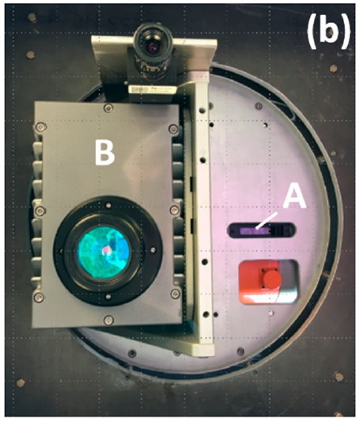
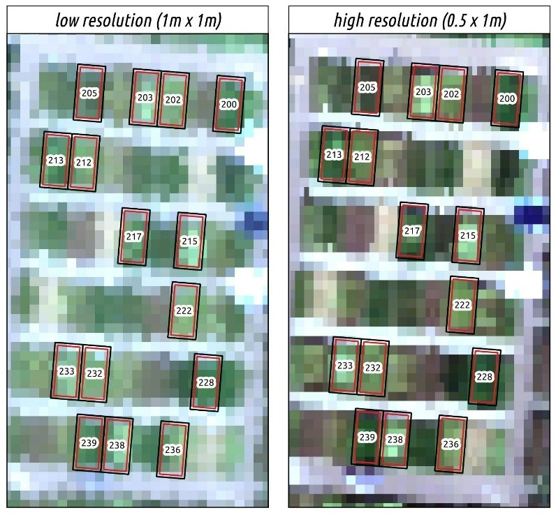
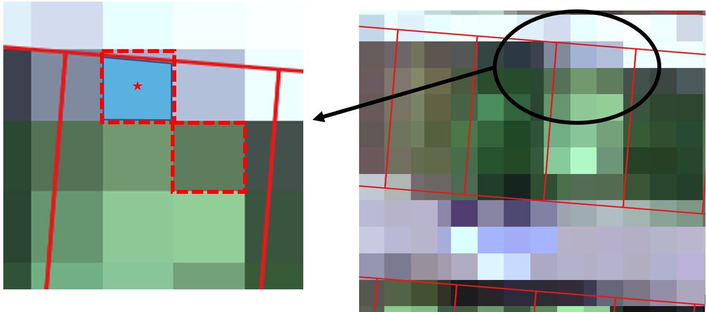

<!-- # ```{css, echo=FALSE} -->
<!-- # body .main-container { -->
<!-- #   max-width: 100% !important; -->
<!-- #   width: 100% !important; -->
<!-- #   margin-left: auto; -->
<!-- #   margin-right: auto; -->
<!-- # } -->
<!-- # body { -->
<!-- #   max-width: 100% !important; -->
<!-- #   margin-left: auto; -->
<!-- #   margin-right: auto; -->
<!-- # } -->
<!-- # ``` -->

<script src="layout/hideOutput.js"></script>

```{r setup, include=FALSE}
library(knitr)
knitr::opts_chunk$set(echo = TRUE, eval=FALSE, results = 'hide', message = FALSE)
```

# Project report {.tabset}

## Report

### Introduction
<div>

  <div class="figure" style="float:right;width:40%;height:40%;font-size:12px;" display="inline-block">
  <span style="display:block;" id="breeding"></span>
  
  <figcaption class="figure-caption text-left">
  figure 1.1: Large scale plant breeding.
  </figcaption>
  </div>

  <p>
  Hyperspectral imaging is nowadays used in a wide range of fields. It is used in 
  quality control of drug manufacturing in medicine, crime scene analysis in 
  forensics or seed viability studies in the agricultural sector, just to name a 
  few.
  In our group project we are looking at the use case in plant breeding.
  One might wonder why hyperspectral imaging is of such great impact in Plant 
  breeding. The first aspects to look at is the high sample size you need to get 
  significant and meaningful data. Let us assume you want to look at around a 
  thousand plots with 30 to a 100 plants per plot. (fig. <a href="#breeding">1.1</a>)
  </p>
  
  <p>
  Now you want to analyse each plot for its reflectance in the morning, afternoon 
  and in the evening. You would need specialized equipment like the field snake 
  (fig. <a href="#fieldsnake">1.2</a>) or the fieldcop (fig. <a href="#fieldcop">1.3</a>), which are great for 
  measuring but would take a lot of time and they need to be calibrated for 
  deviations between different plant species with i.e. varying growth height or 
  plot sizes. Taking hyperspectral images during overflights with an aircraft 
  eliminates the need of calibrating for different plant species, it requires a 
  lot less time to measure a greater area and you have less impact on the testing 
  site. 
  A drawback using airplanes, or any long-range sensor for that matter, is the 
  spectral distortion introduced through the atmosphere between sensor and object.
  This noise can be reduced retrospectively through atmospheric measurements, 
  taken temporally close to the overflights, and correction models.
  </p>
  
  <div class="figure" style="float:left;width:75%;height:75%;font-size:12px;" display="inline-block;">
  <span style="display:block;" id="fieldsnake"></span>
  
  <figcaption class="figure-caption text-left">
  figure 1.2: [Field snake](https://ictagrifood.eu/sites/default/files/deliverables/CKA%20Kurzvorstellung%20BLE%2020.11.2019%20engl%20%28002%29.pdf).
  </figcaption>
  </div>
  <div class="figure" style="width:50%;height:50%;font-size:12px;">
  <span id="fieldcop"></span>
  
  <figcaption class="figure-caption text-left">
  figure 1.3: [Fieldcop](https://www.fz-juelich.de/ibg/ibg-2/EN/methods_jppc/FieldCop/_node.html).
  </figcaption>
  </div>

</div>
\ 

### HyPlant 

<div>

  <div class="figure" style="float:right;width:30%;height:30%;font-size:12px;" display="inline-block">
  <span style="display:block;" id="aircraft"></span>
  
  <figcaption class="figure-caption text-left">
  figure 2.1: HyPlant aircraft and interior.
  </figcaption>
  </div>

  <p>
  The [HyPlant aircraft](https://www.fz-juelich.de/ibg/ibg-2/EN/methods_jppc/HyPlant/_node.html) (fig: <a href="#aircraft">2.1</a>)
  is one example of those “airborne imaging spectrometer[s] for vegetation 
  monitoring” and the data it takes is the focus of the following project report.
  </p>
  <p>
  It consists of two hyperspectral modules in a single housing (fig. <a href="#module">2.2</a>), the DUAL and the 
  FLUO module. 
  The DUAL module, which we chose as the source of our images, has 2 sensors with 
  a spectral range of 370 – 2500nm. The first sensor has a spectral resolution of 
  3 – 10nm in the VIS/NIR range and the second sensor has a resolution of 10 nm in 
  the SWIR range. 
  The second module (FLUO) is for recording the fluorescence of plants. It needs 
  to be much more accurate to make out narrow peaks in the relevant spectrum 
  range. Therefore, it was built to measure with a resolution of 0.25 nm and a much
  smaller range of 670 – 780nm.
  </p>
  <p>
  We chose to work with the data from the DUAL module since it was already 
  atmospheric corrected. The dataset also included two different overflights at 
  different heights. 
  </p>
  
  <div class="figure" style="float:right;width:20%;height:20%;font-size:12px;" display="inline-block">
  <span style="display:block;" id="module"></span>
  
  <figcaption class="figure-caption text-left">
  fig. 2.2: HyPlant sensor (bottom view).
  </figcaption>
  </div>
  
  <p>
  The first overflight was at 12:29 and an altitude of 
  600 meters, the second flight was at 12:42 and 350 meters. The lower overflight
  has a higher resolution, so the overflights will be referred to as 
  “high resolution” and “low resolution” from now on. (see figure <a href="#high-low">2.3</a>)
  </p>
  <p>
  The main aspects of our project work are the implementation and usability of the
  R-Script. We looked at different ways to read, convert and analyse the
  hyperspectral images.Important for these processes are the possible ways in which the image can get 
  filtered for relevant pixels. We labelled the different ways as the 
  “weighted method” and the “minimalistic method”. These methods are later on 
  analysed and compared in terms of accuracy. The accuracy is based on the 
  deviation from the ground measurements, which were taken with the FloX module. 
  The ground measurements should have the least amount of noise, since there
  wasn’t a lot of space that could cause distortions between sensor and object.
  </p>
  <div class="figure" style="width:50%;height:50%;font-size:12px;">
  <span style="display:block;" id="high-low"></span>
  
  <figcaption class="figure-caption text-left">
  fig. 2.3: High and low resolution datasets.
  </figcaption>
  </div>
  <br clear="right"/>
</div>
\ 

### Extraction methods

<div>
  <p>
  The weighted and minimalistic method we created differ in the extraction of 
  relevant pixels.
  
  In more detail this means, that the weighted method extracts pixels that are at 
  least with their centroid inside the plot border. While creating an average for
  the respective plot, it weights the pixels reflection information by the amount
  of pixel area inside the plot borders. This is meant to counter for the 
  influence of pixels near the plot boundaries, which could contain reflection 
  data from outside the plot, while still keeping the highest number of relevant 
  pixels.
  
  The minimalistic method extracts only pixels that are completely inside the 
  plot. Our idea was to minimize the border effect as much as possible. A problem 
  could be, that too many pixels are excluded through this harsh filter and one
  might argue that we won’t have enough data to make justified statements. But 
  even in the worst case, we will still get six pixels with (oder 12? Oder 15?)
  an area of one square meter each and since the manual measurements of the plots 
  would exclude the plants near the boarders as well, we deemed this method as 
  viable.
  
  <div class="figure" style="font-size:12px;">
  <span style="display:block;" id="high-low"></span>
  
  <figcaption class="figure-caption text-left">
  fig. 3.1: Weighted and minimalistic pixel extraction methods.
  </figcaption>
  </div>
  <br>
  
  Since the weighted method doesn’t have a counter for the border effects, we
  created a second shapefile representing buffered plot borders. The 30 cm buffer 
  zone is applied to all plot boundaries, which results in new plot areas of 
  2.4 x 5.4 meters. This reduces the inclusion of non-representative pixels using 
  the weighted method and reduces the pixel count we can expect for the 
  minimalistic method to at least four, which was still deemed enough. 
  <br><br>
  <div class="figure" style="margin-left:auto;margin-right:auto;width:70%;height:70%;font-size:12px;">
  <span style="display:block;" id="pixelcount"></span>
  
  <figcaption class="figure-caption text-left">
  fig. 3.2: Pixel count per plot, resolution and extraction method, \n using the unbuffered plot borders.
  </figcaption>
  </div>
  <br>
  <div class="figure" style="margin-left:auto;margin-right:auto;width:70%;height:70%;font-size:12px;">
  <span style="display:block;" id="pixelcountbuffered"></span>
  
  <figcaption class="figure-caption text-left">
  fig. 3.3: Pixel count per plot, resolution and extraction method, \n using the buffered plot borders.
  </figcaption>
  </div>
  <br><br>
  <p>
  Now we know which pixels we are extracting per method and using the different
  plot boundaries. The next step is to create and use a uniform format for all the
  datasets. This includes filtering the ground measurements taken with the FloX 
  module for comparable data and resampling the spectrum ranges of all datasets 
  to the same range and accuracy. 
  </p>
  
  <br><br>
  <div class="figure" style="float:right;width:51%;height:51%;font-size:12px;" display="inline-block">
  <span style="display:block;" id="resamplingexample"></span>
  
  <figcaption class="figure-caption text-left">
  fig. 3.5: Resampled FloX data. 
  </figcaption>
  </div>
  
  <div class="figure" style="width:40%;height:40%;font-size:12px;">
  <span id="resampling"></span>
  
  <figcaption class="figure-caption text-left">
  fig. 3.4: Wavelength range before and after resampling.
  </figcaption>
  </div>

  <br><br>
  <p>
  The way this is done is explained in more detail in the <a href="#project-report">code section</a> of 
  this document.
  </p>
  After the transmutation of our datasets, they are uniform and ready to be 
  analysed.
  
  Later for analysis
  They all contain reflection data within our defined wavelength range of 
  380 – 960 nm, with intervals of one nanometre. They also have a column 
  containing the plot ID, which is used to make sure, that the right plots get 
  compared.
  </p>
  <br clear="right"/>
</div>
\ 

## Code {.active}

### Introduction {.unlisted .unnumbered .tabset}

We made the code as universal as possible. This means that even if somebody wants to use the script for a different data set, there should only be a few little tweaks in the code needed.<br>
The sections that could need tweaking were marked with **“PTN”** (possible tweak needed). 
\ 

#### Required libraries

The first step in using the script, is loading all the necessary libraries. 
We split them in two sections. </br>
The <a href="#first-libs">first section</a> includes the libraries needed for 
reading the data and converting it. <br> The <a href="#analysis">second section</a> 
includes libraries needed for the analysis.

<div class = "fold s">
```{r first-libs}
library(raster)
library(sf)
library(ggpubr)
library(stringr)
library(hyperSpec)
library(lubridate)
library(tidyverse)
```
</div>
\ 

#### Starting a cluster (optional)

If you are lucky and have a powerful machine to work with, you can set the number of threads here.<br>
**WARNING:** If you do create a cluster, it is highly advised to close it again. <br>
**WARNING:** This is done after the <a href="#extraction-methods-1">pixel extraction</a> chapter, which is the last <br>
**WARNING:** part of the script that needs a lot of computation power.

More information on that <a href="">here</a>

<div class = "fold s">
```{r}
require(snow)
threads <- 3
beginCluster(n = threads)
rm(threads)
```
</div>
\ 

#### Necessary files

After loading all the mentioned libraries so far, we can start reading in the data.

The data extraction of raster files is easily done with the help of a few packages. The most important one is the `raster` package, which enables us to parse through the raster file and extract all pixel values within a polygon (or other shapes) provided by a [shapefile](https://en.wikipedia.org/wiki/Shapefile).

**PTN:** The shape files can be edited directly. You can create a buffer zone using the `dist` parameter of the `st_buffer` function. The example used here creates a 30 cm buffer zone.
We also set the unused “ID” column in the shape file data frame to the number of plots, so it can be used later on.

<div class = "fold s">
```{r}
# Radiance Raster
radiance_1229_600 <- brick("Erfassung_Phänotypen2021/HyPlant data/12:29/20180629-CKA-1229-600-L3-N-DUAL_radiance_img_surfrad-rect_subset.bsq")
radiance_1242_350 <- brick("Erfassung_Phänotypen2021/HyPlant data/12:42/20180629-CKA-1242-350-L2-E-DUAL_radiance_img_surfrad-rect_subset.bsq")

# Plots & Attributes
buffer = FALSE
plots_1229 <- st_read("Erfassung_Phänotypen2021/Shapefiles/Barley_1229.shp")
plots_1242 <- st_read("Erfassung_Phänotypen2021/Shapefiles/Barley_1242.shp")

# Creating a buffer for a second run
#buffer <- TRUE
#plots_1229 <- sf::st_buffer(plots_1229, dist = -0.3, endCapStyle = "SQUARE")
#write_sf(plots_1229, "Erfassung_Phänotypen2021/Shapefiles/Barley_1229_buffered_30_cm.shp")
#plots_1242 <- sf::st_buffer(plots_1242, dist = -0.3, endCapStyle = "SQUARE")
#write_sf(plots_1242, "Erfassung_Phänotypen2021/Shapefiles/Barley_1242_buffered_30_cm.shp")

# Assign ID
plots_1229 <- mutate(plots_1229, ID = seq(1:nrow(plots_1229)), .keep = "all")
plots_1242 <- mutate(plots_1242, ID = seq(1:nrow(plots_1242)), .keep = "all")
```
</div>
\ 

### Pixel extraction {.unlisted .unnumbered .tabset}

#### Methods 

Now that we have the raster and shape files loaded, we can use the shape files to filter for the pixels we want to look at. We use the `extract` function for this purpose. The extraction method is also modified through the parameters of this function. <br><br>
**PTN:** In our case we used the `extract` function in two different ways. 
The first subset should include only pixels, that are completely inside the shape file boarders. For this we use the argument `normalizeWeights = FALSE` and `filter` for pixels with `weight == 1`.<br> 
The second subset should include every pixel with its centroid (centre point) inside the plot border. For this we use the argument `normalizeWeights = TRUE`. This also means that, when it comes to creating a mean reflection for the plot, the included pixels get weighted by their area inside the plot.

<div class = "fold s">
```{r}
## Extract pixel values from radiance map within the shape file
minimalistic_1229_raw <- raster::extract(radiance_1229_600, plots_1229, df = TRUE, weights = TRUE, normalizeWeights = FALSE)
minimalistic_1242_raw <- raster::extract(radiance_1242_350, plots_1242, df = TRUE, weights = TRUE, normalizeWeights = FALSE)
normal_1229_raw <- raster::extract(radiance_1229_600, plots_1229, df = TRUE, weights = TRUE, normalizeWeights = TRUE)
normal_1242_raw <- raster::extract(radiance_1242_350, plots_1242, df = TRUE, weights = TRUE, normalizeWeights = TRUE)

# Filter for weights == 1 (cells fully within), no filter for normal approach
minimalistic_1229 <- filter(minimalistic_1229_raw, weight == 1)
minimalistic_1242 <- filter(minimalistic_1242_raw, weight == 1)
normal_1229 <- normal_1229_raw
normal_1242 <- normal_1242_raw
```
</div>
<br>
At this point we have six different subsets of data.


* Two different extraction methods, 
* two different plot borders, the buffered and unbuffered and 
* two different resolutions, resulting from the varying altitudes of the overflights.


Comparing these subsets and their accuracy in displaying the ground measurements taken by the FloX module is the goal of this project work.
\ 

#### Closing Cluster (optional)

One should always close the Cluster at the end.

```{r}
endCluster()
```
\ 
\ 

#### Rename columns

The first step in cleaning our data and preparing it for the analysis is renaming the columns to the wavelength. There might be different naming conventions in the original datasets, which is why we filter for a pattern that describes the wavelength format.<br>
PTN: In our case the wavelength was divided by 1000. This resulted in this "[0-9][.][0-9]{6}" pattern, for example the wavelength 780.6743 would be 7.806743. You need to check the naming convention in your case and maybe adjust the Regex pattern. Since the wavelength was divided by 1000 for our case, we also multiplied by 1000 before changing the column names of the datasets.

<div class = "fold s">
```{r}
# Rename spectral columns to wavelength
# Rename minimalistic 1229
col_names_bands_1229_minimalistic <- head(colnames(minimalistic_1229_raw)[-1], -1)
# Adjust extraction pattern for pattern of the wavelength. 
# In this case it was divided by 1000, so a wavelength of 997.540 nm is represented as 0.997540 in the column name.
wavelength = "[0-9][.][0-9]{6}"
new_col_names_bands_1229_minimalistic <- as.character(format(as.numeric(str_extract(pattern = wavelength, col_names_bands_1229_minimalistic))*1000))
new_col_names_bands_1229_minimalistic <- append("ID", append(new_col_names_bands_1229_minimalistic, "weight"))
colnames(minimalistic_1229_filtered) <- new_col_names_bands_1229_minimalistic
# Rename minimalistic 1242
col_names_bands_1242_minimalistic <- head(colnames(minimalistic_1242_raw)[-1], -1)
wavelength = "[0-9][.][0-9]{6}"
new_col_names_bands_1242_minimalistic <- as.character(format(as.numeric(str_extract(pattern = wavelength, col_names_bands_1242_minimalistic))*1000))
new_col_names_bands_1242_minimalistic <- append("ID", append(new_col_names_bands_1242_minimalistic, "weight"))
colnames(minimalistic_1242_filtered) <- new_col_names_bands_1242_minimalistic
# Rename normal 1229
col_names_bands_1229_normal <- head(colnames(normal_1229_raw)[-1], -1)
wavelength = "[0-9][.][0-9]{6}"
new_col_names_bands_1229_normal <- as.character(format(as.numeric(str_extract(pattern = wavelength, col_names_bands_1229_normal))*1000))
new_col_names_bands_1229_normal <- append("ID", append(new_col_names_bands_1229_normal, "weight"))
colnames(normal_1229_filtered) <- new_col_names_bands_1229_normal
# Rename normal 1242
col_names_bands_1242_normal <- head(colnames(normal_1242_raw)[-1], -1)
wavelength = "[0-9][.][0-9]{6}"
new_col_names_bands_1242_normal <- as.character(format(as.numeric(str_extract(pattern = wavelength, col_names_bands_1242_normal))*1000))
new_col_names_bands_1242_normal <- append("ID", append(new_col_names_bands_1242_normal, "weight"))
colnames(normal_1242_filtered) <- new_col_names_bands_1242_normal
```
</div>
\ 

#### Aggregate Cell Data

WARNING: Data is multiplied 1000 to transform float values to integer. This explains negative values.
<div class = "fold s">
```{r}
# Join raster data and plot data
minimalistic_1229 <- left_join(minimalistic_1229_filtered, plots_1229, by = "ID")
minimalistic_1242 <- left_join(minimalistic_1242_filtered, plots_1242, by = "ID")
normal_1229 <- left_join(normal_1229_filtered, plots_1229, by = "ID")
normal_1242 <- left_join(normal_1242_filtered, plots_1242, by = "ID")

# Calculate mean for all pixels and spectral bands per plot
bands_mean_minimalistic_1229 <- mutate(minimalistic_1229, across(contains("."), ~ .x / 10))
bands_mean_minimalistic_1229 <- summarise(group_by(bands_mean_minimalistic_1229, PLOTID), across(contains("."), mean))
bands_mean_minimalistic_1242 <- mutate(minimalistic_1242, across(contains("."), ~ .x / 10))
bands_mean_minimalistic_1242 <- summarise(group_by(bands_mean_minimalistic_1242, PLOTID), across(contains("."), mean))
bands_mean_normal_1229 <- mutate(normal_1229, across(contains("."), ~ (.x/10)*weight))
bands_mean_normal_1229 <- summarise(group_by(bands_mean_normal_1229, PLOTID), across(contains("."), sum))
bands_mean_normal_1242 <- mutate(normal_1242, across(contains("."), ~ (.x/10)*weight))
bands_mean_normal_1242 <- summarise(group_by(bands_mean_normal_1242, PLOTID), across(contains("."), sum))

# Rejoin with attribute table of plots
minimalistic_1229_mean <- left_join(bands_mean_minimalistic_1229, plots_1229, by = "PLOTID")
minimalistic_1242_mean <- left_join(bands_mean_minimalistic_1242, plots_1242, by = "PLOTID")
normal_1229_mean <- left_join(bands_mean_normal_1229, plots_1229, by = "PLOTID")
normal_1242_mean <- left_join(bands_mean_normal_1242, plots_1242, by = "PLOTID")
```
</div>
\ 

### Preparations for the analysis {.unlisted .unnumbered .tabset}

#### FloX data

<div class = "fold s">
```{r, results = 'markup'}
# Import FloX data
FloX <- read.csv("Erfassung_Phänotypen2021/FloX_FULL_Reflected_Radiance_180629_converted.csv", header = TRUE, check.names = FALSE)
FloX$`datetime [UTC]` <- as.POSIXct(FloX$`datetime [UTC]`, tz = "UTC")
FloX$`datetime [UTC]` <- with_tz(FloX$`datetime [UTC]`, "CET")
FloX <- rename(FloX, datetime = `datetime [UTC]`)
FloX$Plot <- as.numeric(as.character(FloX$Plot))

# Check for viable FloX data within +- 1h flight time.
viable_flox <- filter(select(FloX, datetime, Plot), Plot < 400 & Plot != "Soil")
viable_flox <- viable_flox[!duplicated(viable_flox$Plot),]

# Reducing FloX data to plots that meet the requirement
#viable_flox <- filter(viable_flox, datetime >= as.POSIXct("2018-06-29 11:37:00", tz = "CET") & 
#                        datetime <= as.POSIXct("2018-06-29 13:24:00", tz = "CET"))
FloX <- filter(FloX, Plot %in% viable_flox$Plot)

# Adjust scale and calculate mean for plots
FloX_mean <- mutate(FloX, across(contains("."), ~ .x/10))
FloX_mean <- summarise(group_by(FloX_mean, Plot), across(!c("doy.dayfract", "datetime"), mean))


# Creating hyperSpec Object, resample wavelengths and cutting data set at 390nm to 940nm
wavelength <- as.numeric(as.character(colnames(FloX_mean[-1])))
spectra.matrix <- as.matrix(select(FloX_mean, contains(".")))
extra.data <- as.matrix(select(FloX_mean, Plot))
spc_flox_raw <- new("hyperSpec", spc = spectra.matrix, wavelength = wavelength, data = data.frame(extra.data), labels = list(spc = expression(mu*W~cm^-2~sr^-1~mu*m^-1), .wavelength = "nm"))
spc_flox <- spc.loess(spc_flox_raw, seq(390, 940, 1)) # sequence of wavelength

# Transfrom hyperSpec back to data frame
spc_flox_df <- as.wide.df(spc_flox)
colnames(spc_flox_df) <- append("PlotID", as.character(seq(390, 940, 1)))
#spc_flox_df$PlotID <- paste0("flox_", as.character(spc_flox_df$PlotID)) 

```
</div>
\ 

#### Hyplant data

<div class = "fold s">
```{r eval=FALSE}
# Filter datasets to only include plots that are also in the FloX data
bands_mean_minimalistic_1229 <- filter(bands_mean_minimalistic_1229, PLOTID %in% viable_flox$Plot)
bands_mean_minimalistic_1242 <- filter(bands_mean_minimalistic_1242, PLOTID %in% viable_flox$Plot)
bands_mean_normal_1229 <- filter(bands_mean_normal_1229, PLOTID %in% viable_flox$Plot)
bands_mean_normal_1242 <- filter(bands_mean_normal_1242, PLOTID %in% viable_flox$Plot)

# Creating hyperSpec Object, resample wavelengths and cutting data set at 390nm to 940nm
wavelength <- as.numeric(as.character(colnames(bands_mean_minimalistic_1229)[-1]))
spectra.matrix <- as.matrix(select(bands_mean_minimalistic_1229, contains(".")))
extra.data <- as.matrix(select(bands_mean_minimalistic_1229, PLOTID)) 
spc_1229_minimalistic_raw <-new("hyperSpec", spc = spectra.matrix, wavelength = wavelength, data = data.frame(extra.data), labels = list(spc = expression(mu*W~cm^-2~sr^-1~mu*m^-1), .wavelength = "nm"))
spc_1229_minimalistic <- spc.loess(spc_1229_minimalistic_raw, seq(390, 940, 1)) # sequence of wavelength

wavelength <- as.numeric(as.character(colnames(bands_mean_minimalistic_1242)[-1]))
spectra.matrix <- as.matrix(select(bands_mean_minimalistic_1242, contains(".")))
extra.data <- as.matrix(select(bands_mean_minimalistic_1242, PLOTID)) 
spc_1242_minimalistic_raw <-new("hyperSpec", spc = spectra.matrix, wavelength = wavelength, data = data.frame(extra.data), labels = list(spc = expression(mu*W~cm^-2~sr^-1~mu*m^-1), .wavelength = "nm"))
spc_1242_minimalistic <- spc.loess(spc_1242_minimalistic_raw, seq(390, 940, 1))

wavelength <- as.numeric(as.character(colnames(bands_mean_normal_1229)[-1]))
spectra.matrix <- as.matrix(select(bands_mean_normal_1229, contains(".")))
extra.data <- as.matrix(select(bands_mean_normal_1229, PLOTID)) 
spc_1229_normal_raw <-new("hyperSpec", spc = spectra.matrix, wavelength = wavelength, data = data.frame(extra.data), labels = list(spc = expression(mu*W~cm^-2~sr^-1~mu*m^-1), .wavelength = "nm"))
spc_1229_normal <- spc.loess(spc_1229_normal_raw, seq(390, 940, 1))

wavelength <- as.numeric(as.character(colnames(bands_mean_normal_1242)[-1]))
spectra.matrix <- as.matrix(select(bands_mean_normal_1242, contains(".")))
extra.data <- as.matrix(select(bands_mean_normal_1242, PLOTID)) 
spc_1242_normal_raw <-new("hyperSpec", spc = spectra.matrix, wavelength = wavelength, data = data.frame(extra.data), labels = list(spc = expression(mu*W~cm^-2~sr^-1~mu*m^-1), .wavelength = "nm"))
spc_1242_normal <- spc.loess(spc_1242_normal_raw, seq(390, 940, 1))

# Transform hyperSpec back to data frame
spc_1229_minimalistic_df <- as.wide.df(spc_1229_minimalistic)
colnames(spc_1229_minimalistic_df) <- append("PlotID", as.character(seq(390, 940, 1)))
#spc_1229_minimalistic_df$PlotID <- paste0("minimalistic_1229_", as.character(spc_1229_minimalistic_df$PlotID)) 

spc_1242_minimalistic_df <- as.wide.df(spc_1242_minimalistic)
colnames(spc_1242_minimalistic_df) <- append("PlotID", as.character(seq(390, 940, 1)))
#spc_1242_minimalistic_df$PlotID <- paste0("minimalistic_1242_", as.character(spc_1242_minimalistic_df$PlotID)) 

spc_1229_normal_df <- as.wide.df(spc_1229_normal)
colnames(spc_1229_normal_df) <- append("PlotID", as.character(seq(390, 940, 1)))
#spc_1229_normal_df$PlotID <- paste0("normal_1229_", as.character(spc_1229_normal_df$PlotID)) 

spc_1242_normal_df <- as.wide.df(spc_1242_normal)
colnames(spc_1242_normal_df) <- append("PlotID", as.character(seq(390, 940, 1)))
#spc_1242_normal_df$PlotID <- paste0("normal_1242_", as.character(spc_1242_normal_df$PlotID)) 

```
</div>
\ 

### Analysis {.unlisted .unnumbered .tabset}

Graphs-with-explanations Graphs-with-explanations Graphs-with-explanations 
Graphs-with-explanations Graphs-with-explanations Graphs-with-explanations 
Graphs-with-explanations Graphs-with-explanations Graphs-with-explanations 
Graphs-with-explanations Graphs-with-explanations Graphs-with-explanations 
Graphs-with-explanations Graphs-with-explanations Graphs-with-explanations 

#### Required libraries

<div class = "fold s">
```{r}
library(lubridate)
library(readxl)
library(hyperSpec)
library(factoextra)
library(ggsignif)
library(ggpubr)
library(tidyverse)
```
</div>
\ 

  
#### Spectral plots {.tabset}

##### Raw FloX and HyPlant wavelength per plot {.active}

<div class = "fold s">
```{r, results = 'markup'}
# FloX
par(mar = c(5,6,3,1)+.1)
plot(spc_flox [,,], "spcprctl5") #spcprctile
title(main = "Top-of-canopy radiance FloX", outer = FALSE)

# Overflight at 12:29 o'clock, minimalistic approach
par(mar = c(4,6,1,0)+.1, mfrow = c(2,2), oma = c(1,1,3,1))
plot(spc_1229_minimalistic [,,], "spcprctl5")
title(main="minimalistic, 12:29 o'clock")

# Overflight at 12:42 o'clock, minimalistic approach
plot(spc_1242_minimalistic [,,], "spcprctl5")
title(main="minimalistic, 12:42 o'clock")

# Overflight at 12:29 o'clock, normal approach
plot(spc_1229_normal [,,], "spcprctl5")
title(main="normal, 12:29 o'clock")

# Overflight at 12:42 o'clock, normal approach
plot(spc_1242_normal [,,], "spcprctl5")
title(main="normal, 12:42 o'clock")
mtext("Top-of-canopy radiance DUAL", outer=TRUE,  cex=1.2, line=1.5)


#test <- spc_1229_normal / rowMeans(spc_1229_normal)
#plot(test, "spcprctl5")
#plot(spc_1229_normal, "spcprctl5")

# plot(spc_1229_minimalistic [,,])
# plot(spc_1229_minimalistic_new [,,])
# spc_1229_minimalistic_new@wavelength
# {plot(spc_1229_minimalistic_raw [,,], col = "blue")
# plot(spc_1229_minimalistic [,,], col = "red", add = TRUE)}
# ggplot (as.long.df (spc_1229_minimalistic_new[1]), aes (x = .wavelength, y =spc)) + geom_line ()

```
</div>
\ 

##### Plots normalized against Flox

<div class = "fold s">
```{r, results = 'markup'}
# Overflight at 12:29 o'clock, minimalistic approach
par(mar = c(4,6,1,0)+.1, mfrow = c(2,2), oma = c(1,1,4,1), yaxs = "r")
plot(spc_flox - spc_1229_minimalistic [,,], "spcmeansd")
title(main="minimalistic, 12:29 o'clock")

# Overflight at 12:42 o'clock, minimalistic approach
plot(spc_flox - spc_1242_minimalistic [,,], "spcmeansd")
title(main="minimalistic, 12:42 o'clock")

# Overflight at 12:29 o'clock, normal approach
plot(spc_flox - spc_1229_normal [,,], "spcmeansd")
title(main="normal, 12:29 o'clock")

# Overflight at 12:42 o'clock, normal approach
plot(spc_flox - spc_1242_normal [,,], "spcmeansd")
title(main="normal, 12:42 o'clock")
mtext("Top-of-canopy radiance DUAL\n(normalized against FloX)", outer=TRUE,  cex=1.1, line=1.2)

#qplotspc(mean(spc_flox - spc_1229_minimalistic [,,]))+
#  geom_ribbon(aes (ymin = mean + sd, ymax = mean - sd, y =  0, group = NA), alpha #= 0.25, data = as.t.df (mean_sd (spc_flox - spc_1229_minimalistic [,,])))


# plot(spc_1229_minimalistic [,,])
# plot(spc_1229_minimalistic_new [,,])
# spc_1229_minimalistic_new@wavelength
# {plot(spc_1229_minimalistic_raw [,,], col = "blue")
# plot(spc_1229_minimalistic [,,], col = "red", add = TRUE)}
# ggplot (as.long.df (spc_1229_minimalistic_new[1]), aes (x = .wavelength, y =spc)) + geom_line ()

```
</div>
\ 

#### Checking pixel count per Plot {.tabset}

##### Code

<div class = "fold s">
```{r}
# Create data frame with pixel count per plot
frq_pixel_minimalistic_1229 <- rename(data.frame(table(minimalistic_1229$PLOTID)), PlotID = Var1)
frq_pixel_minimalistic_1229$PlotID <- as.numeric(as.character(frq_pixel_minimalistic_1229$PlotID))
frq_pixel_minimalistic_1242 <- rename(data.frame(table(minimalistic_1242$PLOTID)), PlotID = Var1)
frq_pixel_minimalistic_1242$PlotID <- as.numeric(as.character(frq_pixel_minimalistic_1242$PlotID))
frq_pixel_normal_1229 <- rename(data.frame(table(normal_1229$PLOTID)), PlotID = Var1)
frq_pixel_normal_1229$PlotID <- as.numeric(as.character(frq_pixel_normal_1229$PlotID))
frq_pixel_normal_1242 <- rename(data.frame(table(normal_1242$PLOTID)), PlotID = Var1)
frq_pixel_normal_1242$PlotID <- as.numeric(as.character(frq_pixel_normal_1242$PlotID))

# Get FID to separate between big and small plots. (Only small plots have a FID)
frq_pixel_minimalistic_1229 <- full_join(unique(select(minimalistic_1229, PlotID = PLOTID, Plots = ID)), frq_pixel_minimalistic_1229, by = "PlotID")
frq_pixel_minimalistic_1229 <- mutate(frq_pixel_minimalistic_1229, Plots = if_else(Plots > 42, "3 x 3 m", "3 x 6 m"))
frq_pixel_minimalistic_1242 <- full_join(unique(select(minimalistic_1242, PlotID = PLOTID, Plots = ID)), frq_pixel_minimalistic_1242, by = "PlotID")
frq_pixel_minimalistic_1242 <- mutate(frq_pixel_minimalistic_1242, Plots = if_else(Plots > 42, "3 x 3 m", "3 x 6 m"))
frq_pixel_normal_1229 <- full_join(unique(select(normal_1229, PlotID = PLOTID, Plots = ID)), frq_pixel_normal_1229, by = "PlotID")
frq_pixel_normal_1229 <- mutate(frq_pixel_normal_1229, Plots = if_else(Plots > 42, "3 x 3 m", "3 x 6 m"))
frq_pixel_normal_1242 <- full_join(unique(select(normal_1242, PlotID = PLOTID, Plots = ID)), frq_pixel_normal_1242, by = "PlotID")
frq_pixel_normal_1242 <- mutate(frq_pixel_normal_1242, Plots = if_else(Plots > 42, "3 x 3 m", "3 x 6 m"))

# Creating table for plot
frq_pixel_minimalistic_1229 <- mutate(filter(frq_pixel_minimalistic_1229, Plots == "3 x 6 m", PlotID %in% viable_flox$Plot), measurement = "1229", approach =  "minimalistic")
frq_pixel_minimalistic_1242 <- mutate(filter(frq_pixel_minimalistic_1242, Plots == "3 x 6 m", PlotID %in% viable_flox$Plot), measurement = "1242", approach =  "minimalistic")
frq_pixel_normal_1229 <- mutate(filter(frq_pixel_normal_1229, Plots == "3 x 6 m", PlotID %in% viable_flox$Plot), measurement = "1229", approach =  "normal")
frq_pixel_normal_1242 <- mutate(filter(frq_pixel_normal_1242, Plots == "3 x 6 m", PlotID %in% viable_flox$Plot), measurement = "1242", approach =  "normal")

pixel_count_comparision <- rbind(frq_pixel_minimalistic_1229,
                                 frq_pixel_normal_1229,
                                 frq_pixel_minimalistic_1242,
                                 frq_pixel_normal_1242)

```
</div>
\ 

##### Table

<div class = "fold s">
```{r echo=FALSE, results='markup'}
knitr::kable(rename(summarise(group_by(frq_pixel_minimalistic_1229, Freq, Plots), "Occurrences" = n()), "Pixel per plot" = Freq), align = 'c', caption = "Minimalistic pixel extraction, 12:29 Uhr")
knitr::kable(rename(summarise(group_by(frq_pixel_minimalistic_1242, Freq, Plots), "Occurrences" = n()), "Pixel per plot" = Freq), align = 'c', caption = "Minimalistic pixel extraction, 12:42 Uhr")
knitr::kable(rename(summarise(group_by(frq_pixel_normal_1229, Freq, Plots), "Occurrences" = n()), "Pixel per plot" = Freq), align = 'c',
             caption = "Normal pixel extraction, 12:29 Uhr")
knitr::kable(rename(summarise(group_by(frq_pixel_normal_1242, Freq, Plots), "Occurrences" = n()), "Pixel per plot" = Freq), align = 'c',
             caption = "Normal pixel extraction, 12:42 Uhr")
```
</div>
\ 

##### Plots

Occurrences of pixel count per plot within big and small plots

<div class = "fold s">
```{r echo=FALSE, results='markup', message=FALSE}
# Creating plots
measurement.labs <- c("low resolution (1m x 1m)", "high resolution (0.5m x 1m)")
names(measurement.labs) <- c("1229", "1242")

ggplot(pixel_count_comparision, aes(x = Freq, fill = approach))+
  geom_bar() +
  ggtitle("Number of pixels in non-buffered plots")+
  xlab("Pixel per Plot") +
  ylab("Counts")+
  facet_wrap(vars(measurement), labeller = labeller(measurement = measurement.labs), scales = "free_x", shrink = TRUE)+
  scale_fill_manual(values = rep(c("#fa3232", "#3296fa"), 2), name = "Extraction method:", labels = c("minimalistic", "weighted"))+
  scale_x_continuous(breaks = seq(0,100, 5))+
  theme(panel.background = element_rect(colour = "#D9D9D9", size = 1.5),
        plot.title = element_text(vjust = 2, hjust = 0.5),
        axis.title.y = element_text(vjust = 2),
        axis.title.x = element_text(vjust = -1),
        axis.text.x = element_text(size = 10),
        strip.text = element_text(size = 12),
        panel.spacing = unit(3, "lines"),
        legend.position = "bottom")

```
</div>

<!--Warning mechanism if any Plots don't have a single pixel -->
<div class = "fold s">
```{r, echo=FALSE, results='asis'}
# Check and print plots with no pixels being extracted
diff = setdiff(unique(minimalistic_1229$ID), seq(1:nrow(plots_1229)))
if(!is_empty(diff)) print(paste0("WARNING: No pixel extracted for following plots in minimalistic at 12:29 o'clock: ", diff))
diff = setdiff(unique(minimalistic_1242$ID), seq(1:nrow(plots_1242)))
if(!is_empty(diff)) print(paste0("WARNING: No pixel extracted for following plots in minimalistic at 12:42 o'clock: ", diff))
diff = setdiff(unique(normal_1229$ID), seq(1:nrow(plots_1229)))
if(!is_empty(diff)) print(paste0("WARNING: No pixel extracted for following plots:  in normal at 12:29 o'clock:", diff))
diff = setdiff(unique(normal_1242$ID), seq(1:nrow(plots_1242)))
if(!is_empty(diff)) print(paste0("WARNING: No pixel extracted for following plots in normal at 12:42 o'clock: ", diff))
```
</div>
\ 

<!--
# Question: How are smaller pixels (caused by rectification) are handled? Do they count on there own? Or are they part of another pixel?
# Or does the Picture has unequal pixels in it?
-->


#### Principal Conponent Analysis (PCA) {.tabset}

The idea is to reduce the data in their dimensions and detect where the largest variation lies. By comparing the principal components of the FloX and the HyPlant we can detect whether both sensors captured the same variation and which approach is best suited for data extraction.

##### Single datasets {.tabset}

###### Code

<div class = "fold s">
```{r}
pca_flox <- prcomp(spc_flox, scale = TRUE)
pca_1229_minimalistic <- prcomp(spc_1229_minimalistic, scale = TRUE)
pca_1229_normal <- prcomp(spc_1229_normal, scale = TRUE)
pca_1242_minimalistic <- prcomp(spc_1242_minimalistic, scale = TRUE)
pca_1242_normal <- prcomp(spc_1242_normal, scale = TRUE)
```
</div>
\ 

###### FloX eigenvalues

<div class = "fold s">
```{r}
fviz_eig(pca_flox, title = "PCA: FloX", addlabels = TRUE)
# fviz_pca_ind(pca_flox,
#              col.ind = "cos2", # Colour by the quality of representation
#              gradient.cols = c("#00AFBB", "#E7B800", "#FC4E07"),
#              title = "PCA: FloX", # with quality of representation # Avoid text overlapping
#              repel = TRUE     # Avoid text overlapping
# )
```
</div>
\ 

###### Minimalistic, low resolution

<div class = "fold s">
```{r}
fviz_eig(pca_1229_minimalistic, title = "PCA: Low resolution, minimalistic", addlabels = TRUE)
# fviz_pca_ind(pca_1229_minimalistic,
#              col.ind = "cos2", # Colour by the quality of representation
#              gradient.cols = c("#00AFBB", "#E7B800", "#FC4E07"),
#              title = "PCA: Low resolution, minimalistic", # with quality of representation # Avoid text overlapping
#              repel = TRUE     # Avoid text overlapping
# )
```
</div>
\ 

###### Normal, low resolution

<div class = "fold s">
```{r}
fviz_eig(pca_1229_normal, title = "PCA: Low resolution, normal", addlabels = TRUE)
# fviz_pca_ind(pca_1229_normal,
#              col.ind = "cos2", # Colour by the quality of representation
#              gradient.cols = c("#00AFBB", "#E7B800", "#FC4E07"),
#              title = "PCA: Low resolution, normal", # with quality of representation # Avoid text overlapping
#              repel = TRUE     # Avoid text overlapping
# )
```
</div>
\ 

###### Minimalistic, high resolution

<div class = "fold s">
```{r}
fviz_eig(pca_1242_minimalistic, title = "PCA: High resolution, minimalistic", addlabels = TRUE)
# fviz_pca_ind(pca_1242_minimalistic,
#              col.ind = "cos2", # Colour by the quality of representation
#              gradient.cols = c("#00AFBB", "#E7B800", "#FC4E07"),
#              title = "PCA: High resolution, minimalistic", # with quality of representation # Avoid text overlapping
#              repel = TRUE     # Avoid text overlapping
# )
```
</div>
\ 

###### Normal, high resolution

<div class = "fold s">
```{r}
fviz_eig(pca_1242_normal, title = "PCA: High resolution, normal", addlabels = TRUE)
# fviz_pca_ind(pca_1242_normal,
#              col.ind = "cos2", # Colour by the quality of representation
#              gradient.cols = c("#00AFBB", "#E7B800", "#FC4E07"),
#              title = "PCA: High resolution, normal", # with quality of representation # Avoid text overlapping
#              repel = TRUE,    # Avoid text overlapping
#              addEllipsis = TRUE
# )
```
</div>
\ 

##### All datasets combined {.tabset}

###### Code

<div class = "fold s">
```{r}
# Add columns to group data for later on
# FloX
spc_flox_df <- mutate(spc_flox_df, measurement = "flox", approach = "flox", .after = "PlotID")
spc_flox_df <- mutate(spc_flox_df, comb = paste0(approach, "_", PlotID), .before = "PlotID")
# Minimalistic 1229
spc_1229_minimalistic_df <- mutate(spc_1229_minimalistic_df, measurement = "1229", approach =  "minimalistic", .after = PlotID)
spc_1229_minimalistic_df <- mutate(spc_1229_minimalistic_df, comb = paste0(approach, "_", measurement, "_", PlotID), .before = "PlotID")
# Minimalistic 1242
spc_1242_minimalistic_df <- mutate(spc_1242_minimalistic_df, measurement = "1242", approach =  "minimalistic", .after = PlotID)
spc_1242_minimalistic_df <- mutate(spc_1242_minimalistic_df, comb = paste0(approach, "_", measurement, "_", PlotID), .before = "PlotID")
# Normal 1229
spc_1229_normal_df <- mutate(spc_1229_normal_df, measurement = "1229", approach =  "normal", .after = PlotID)
spc_1229_normal_df <- mutate(spc_1229_normal_df, comb = paste0(approach, "_", measurement, "_", PlotID), .before = "PlotID")
# Normal 1242
spc_1242_normal_df <- mutate(spc_1242_normal_df, measurement = "1242", approach =  "normal", .after = PlotID)
spc_1242_normal_df <- mutate(spc_1242_normal_df, comb = paste0(approach, "_", measurement, "_", PlotID), .before = "PlotID")

# Create one dataset per PCA
if(buffer == FALSE){
  pca_data_all <- rbind(spc_flox_df, spc_1229_minimalistic_df, spc_1229_normal_df, spc_1242_minimalistic_df, spc_1242_normal_df)
  pca_data_all <- mutate(pca_data_all, buffer = FALSE, .after = approach)
  pca_data_all <- mutate(pca_data_all, comb = paste0(comb, "_", buffer))
  write_csv(pca_data_all, "results/data_for_pca_all.csv")
}else{
  pca_data_all <- rbind(spc_flox_df, spc_1229_minimalistic_df, spc_1229_normal_df, spc_1242_minimalistic_df, spc_1242_normal_df)
  pca_data_all <- mutate(pca_data_all, buffer = TRUE, .after = approach)
  pca_data_all <- mutate(pca_data_all, comb = paste0(comb, "_", buffer))
  write_csv(pca_data_all, "results/data_for_pca_all_buffered.csv")
}
data_for_pca <- read.csv("results/data_for_pca_all.csv")
data_for_pca_buffered <- read.csv("results/data_for_pca_all_buffered.csv")
pca_data_all <- rbind(data_for_pca, filter(data_for_pca_buffered, !(measurement == "flox")))
# Add row names to distinguish data points later on
rownames(pca_data_all) = make.names(pca_data_all[,1], unique=TRUE)
pca_all <- prcomp(pca_data_all[,-c(1:5)], scale = TRUE)
#summary(pca_all)
```
</div>
\ 

###### Eigenvalues 

<div class = "fold s">
```{r}
fviz_eig(pca_all, title = "PCA: all", addlabels = TRUE)
```
</div>
\ 

###### Individuals

<div class = "fold s">
```{r}
annotation <- as.character(factor(paste0(pca_data_all$approach, "_", pca_data_all$buffer), levels = c("flox_FALSE", "minimalistic_FALSE",  "minimalistic_TRUE", "normal_FALSE", "normal_TRUE"), labels = c("FloX", "Minimalistic", "Minimalistic", "Weighted", "Weighted")))
fviz_pca_ind(pca_all,
             habillage = annotation,
             col.ind = pca_data_all$PlotID,
             label = "ind.sup",
             palette = "lanct",
             geom.ind = "point",
             addEllipses = TRUE,
             ggtheme = theme_minimal()
             )
```
</div>
\ 

##### Calculating coordinates

Now we are going to calculate the distance between the pca coordinates (2 dimensions) and each set.

<div class = "fold s">
```{r}
# Get coordinates of the individuals in the first two dimensions
res.ind <- get_pca_ind(pca_all)
coor_all <- res.ind$coord
coor_all <- as.data.frame(coor_all)[,c(1,2)]
coor_all <- rownames_to_column(coor_all, "comb")

# Get grouping information into coordinate data
coor_all <- inner_join(coor_all, pca_data_all[,c(1:5)])
coor_all <- coor_all[,-1]

# Separate all plots into small tables for each group
coor_flox_unsorted <- filter(coor_all, measurement == "flox")
coor_flox <- coor_flox_unsorted[order(coor_flox_unsorted$PlotID),]
rm(coor_flox_unsorted)

# Pre-define table
distance_comparision <- data.frame(PlotID = integer(), resolution = character(), approach = character(), buffer = logical(), distance = double())

for(i in c(FALSE, TRUE)){
  coor_1229_minimalistic_unsorted <- filter(coor_all, measurement == "1229" & approach == "minimalistic", buffer == as.logical(i))
  coor_1229_minimalistic <- coor_1229_minimalistic_unsorted[order(coor_1229_minimalistic_unsorted$PlotID),]
  
  coor_1229_normal_unsorted <- filter(coor_all, measurement == "1229" & approach == "normal", buffer == i)
  coor_1229_normal <- coor_1229_normal_unsorted[order(coor_1229_normal_unsorted$PlotID),]
  
  coor_1242_minimalistic_unsorted <- filter(coor_all, measurement == "1242" & approach == "minimalistic", buffer == i)
  coor_1242_minimalistic <- coor_1242_minimalistic_unsorted[order(coor_1242_minimalistic_unsorted$PlotID),]
  
  coor_1242_normal_unsorted <- filter(coor_all, measurement == "1242" & approach == "normal", buffer == i)
  coor_1242_normal <- coor_1242_normal_unsorted[order(coor_1242_normal_unsorted$PlotID),]
  
  rm(coor_1229_minimalistic_unsorted, coor_1229_normal_unsorted, coor_1242_minimalistic_unsorted, coor_1242_normal_unsorted)
  
  # Calculate the distance from FloX to each grouping set
  distance_minimalistic_1229 <- abs(sqrt((coor_flox$Dim.1- coor_1229_minimalistic$Dim.1)^2 + (coor_flox$Dim.2- coor_1229_minimalistic$Dim.2)^2))
  distance_normal_1229 <- abs(sqrt((coor_flox$Dim.1- coor_1229_normal$Dim.1)^2 + (coor_flox$Dim.2- coor_1229_normal$Dim.2)^2))
  distance_minimalistic_1242 <- abs(sqrt((coor_flox$Dim.1- coor_1242_minimalistic$Dim.1)^2 + (coor_flox$Dim.2- coor_1242_minimalistic$Dim.2)^2))
  distance_normal_1242 <- abs(sqrt((coor_flox$Dim.1- coor_1242_normal$Dim.1)^2 + (coor_flox$Dim.2- coor_1242_normal$Dim.2)^2))
  
  # Create table for each distance and bind them to plot
  distance_minimalistic_1229_df = data.frame(PlotID = unique(coor_flox$PlotID), 
                                             resolution = "low", 
                                             approach = "minimalistic", 
                                             buffer = i, 
                                             distance = distance_minimalistic_1229)
  distance_normal_1229_df = data.frame(PlotID = unique(coor_flox$PlotID), 
                                       resolution = "low", 
                                       approach = "normal",  
                                       buffer = i, 
                                       distance = distance_normal_1229)
  distance_minimalistic_1242_df = data.frame(PlotID = unique(coor_flox$PlotID), 
                                             resolution = "high", 
                                             approach = "minimalistic",  
                                             buffer = i, 
                                             distance = distance_minimalistic_1242)
  distance_normal_1242_df = data.frame(PlotID = unique(coor_flox$PlotID), 
                                       resolution = "high", 
                                       approach = "normal",  
                                       buffer = i, 
                                       distance = distance_normal_1242)
  distance_comparision <- rbind(distance_comparision,
                                distance_minimalistic_1229_df,
                                distance_normal_1229_df,
                                distance_minimalistic_1242_df, 
                                distance_normal_1242_df)
}

write.csv(distance_comparision, file = "results/distance_comparison.csv", row.names = FALSE)
```
</div>
\ 

### Plotting score distance {.unlisted .unnumbered} 

<div class = "fold s">
```{r}
# Loading saved data from different runs.
distance_comparision <- select(filter(read.csv("results/distance_comparison.csv"), buffer == FALSE), !buffer)
distance_comparision$resolution <- factor(distance_comparision$resolution, levels = c("low", "high"))
distance_comparision_buffered <- filter(read.csv("results/distance_comparison.csv"), buffer == TRUE)
distance_comparision_buffered$resolution <- factor(distance_comparision_buffered$resolution, levels = c("low", "high"))
comparison_distance_non_vs_buffered <- read.csv("results/distance_comparison.csv")
comparison_distance_non_vs_buffered$buffer <- factor(comparison_distance_non_vs_buffered$buffer, levels = c(FALSE,TRUE), labels = c("non-buffered", "buffered"))
```
</div>
\ 

### Test for normality {.unlisted .unnumbered}

<div class = "fold s">
```{r}
# Unbuffered
shapiro.test(filter(distance_comparision, resolution == "low" & approach == "minimalistic")$distance)
shapiro.test(filter(distance_comparision, resolution == "low" & approach == "normal")$distance)
shapiro.test(filter(distance_comparision, resolution == "high" & approach == "minimalistic")$distance)
shapiro.test(filter(distance_comparision, resolution == "high" & approach == "normal")$distance)

# Using buffered Data
shapiro.test(filter(distance_comparision_buffered, resolution == "low" & approach == "minimalistic")$distance)
shapiro.test(filter(distance_comparision_buffered, resolution == "low" & approach == "normal")$distance)
shapiro.test(filter(distance_comparision_buffered, resolution == "high" & approach == "minimalistic")$distance)
shapiro.test(filter(distance_comparision_buffered, resolution == "high" & approach == "normal")$distance)
```
</div>
\ 

### One sided t-test to compare methods and resolutions with each other. {.unlisted .unnumbered}

<div class = "fold s">
```{r, results='markup', collapse=TRUE}

distance_minimalistic_1229 <- distance_comparision[distance_comparision$resolution == "low"
                                                  & distance_comparision$approach == "minimalistic",
                                                  "distance"]
distance_minimalistic_1242 <- distance_comparision[distance_comparision$resolution == "high"
                                                  & distance_comparision$approach == "minimalistic",
                                                  "distance"]
distance_normal_1229 <- distance_comparision[distance_comparision$resolution == "low"
                                                  & distance_comparision$approach == "normal",
                                                  "distance"]
distance_normal_1242 <- distance_comparision[distance_comparision$resolution == "high"
                                                  & distance_comparision$approach == "normal",
                                                  "distance"]
print("Unbuffered data set")
print("Comparison between extraction methods at low resolution:")
t_test_min_norm_1229 <- t.test(distance_minimalistic_1229, distance_normal_1229, alternative = "less", conf.level = 0.95, paired = TRUE)
print(paste("p.value:", format(t_test_min_norm_1229$p.value, format = "e", digits = 2)))
print("Comparison between extraction methods at high resolution:")
t_test_min_norm_1242 <- t.test(distance_minimalistic_1242, distance_normal_1242, alternative = "less", conf.level = 0.95, paired = TRUE)
print(paste("p.value:", format(t_test_min_norm_1242$p.value, format = "e", digits = 2)))
print("Comparison between low and high resolution with minimalistic extraction method:")
t_test_min_1242_1229 <- t.test(distance_minimalistic_1242, distance_minimalistic_1229, alternative = "less", conf.level = 0.95, paired = TRUE)
print(paste("p.value:", format(t_test_min_1242_1229$p.value, format = "e", digits = 2)))
print("Comparison between low and high resolution with normal extraction method:")
t_test_norm_1242_1229 <- t.test(distance_normal_1242, distance_normal_1229, alternative = "less", conf.level = 0.95, paired = TRUE)
print(paste("p.value:", format(t_test_norm_1242_1229$p.value, format = "e", digits = 2)))

# Buffered data set
distance_minimalistic_1229 <- distance_comparision_buffered[distance_comparision_buffered$resolution == "low"
                                                  & distance_comparision_buffered$approach == "minimalistic",
                                                  "distance"]
distance_minimalistic_1242 <- distance_comparision_buffered[distance_comparision_buffered$resolution == "high"
                                                  & distance_comparision_buffered$approach == "minimalistic",
                                                  "distance"]
distance_normal_1229 <- distance_comparision_buffered[distance_comparision_buffered$resolution == "low"
                                                  & distance_comparision_buffered$approach == "normal",
                                                  "distance"]
distance_normal_1242 <- distance_comparision_buffered[distance_comparision_buffered$resolution == "high"
                                                  & distance_comparision_buffered$approach == "normal",
                                                  "distance"]
print("Buffered data set")
print("Comparison between extraction methods at low resolution:")
t_test_min_norm_1229 <- t.test(distance_minimalistic_1229, distance_normal_1229, alternative = "less", conf.level = 0.95, paired = TRUE)
print(paste("p.value:", format(t_test_min_norm_1229$p.value, format = "e", digits = 2)))
print("Comparison between extraction methods at high resolution:")
t_test_min_norm_1242 <- t.test(distance_minimalistic_1242, distance_normal_1242, alternative = "less", conf.level = 0.95, paired = TRUE)
print(paste("p.value:", format(t_test_min_norm_1242$p.value, format = "e", digits = 2)))
print("Comparison between low and high resolution with minimalistic extraction method:")
t_test_min_1242_1229 <- t.test(distance_minimalistic_1242, distance_minimalistic_1229, alternative = "less", conf.level = 0.95, paired = TRUE)
print(paste("p.value:", format(t_test_min_1242_1229$p.value, format = "e", digits = 2)))
print("Comparison between low and high resolution with normal extraction method:")
t_test_norm_1242_1229 <- t.test(distance_normal_1242, distance_normal_1229, alternative = "less", conf.level = 0.95, paired = TRUE)
print(paste("p.value:", format(t_test_norm_1242_1229$p.value, format = "e", digits = 2)))
```
</div>
\ 

### Results {.tabset .unlisted .unnumbered}

#### Unbuffered data set

The first comparison is between the two extraction methods at different resolutions with the non-buffered data set. This can be considered the worst case for the weighted extraction method, as it includes pixels that are partially outside the plot. At the same time the minimalistic extraction method does only includes pixels completely inside, which is some kind of a buffer itself. Thus, in this scenario the difference in the score distance between the both extraction method is highly significant in at both resolutions, with the minimalistic method being closer to the reference value produced by FloX. One can see the clear trend by lines indicating the pairwise comparison.

```{r, non-buffered-comp-method, echo=FALSE}
# Plotting the difference of the distances
resolution.labs <- c("low resolution (1m x 1m)", "high resolution (0.5m x 1m)")
names(resolution.labs) <- c("low", "high")
boxplot_comparison_approach <- ggplot(distance_comparision, aes(x = approach, y = distance, fill = approach, group = approach))+
  stat_boxplot(geom = "errorbar", size = 0.3, width = 0.1)+
  geom_boxplot(show.legend = FALSE, size = 0.3, position = "dodge", outlier.alpha = 0)+
  geom_point(aes(shape = approach), show.legend = FALSE, position = position_dodge2(width = 0.1))+
  geom_line(aes(group = PlotID), linetype = "dotted", size = 0.4, position = position_dodge2(width = 0.1))+
  scale_shape_manual(values = rep(c(2,0),2))+
  scale_fill_manual(values = rep(c("#c8e0e4", "#669999"), 2))+
  ylab("score distance")+
  scale_x_discrete("extraction method", labels = c("minimalistic" = "minimalistic", "normal" = "weighted"))+
  ggtitle("Score distance of the minimalistic and weighted extraction method")+
  facet_wrap(resolution ~ ., ncol = 2, labeller = labeller(resolution = resolution.labs))+
  geom_signif(comparisons = list(c("minimalistic","normal")), map_signif_level = TRUE, test = "wilcox.test", test.args = list(alternative = "less", paired = TRUE), margin_top = 0.1, vjust = 0.4)+
  # For actual p.values instead of * use: map_signif_level = function(p) sprintf("p = %.2g", p)
  theme(panel.background = element_rect(fill = "#FFFFFF", colour = "#D9D9D9", size = 1),
        panel.grid = element_line(colour = "#D9D9D9"),
        plot.title = element_text(vjust = 2, hjust = 0.5),
        axis.title.y = element_text(vjust = 2),
        axis.title.x = element_text(vjust = -1),
        axis.text.x = element_text(size = 10),
        strip.text = element_text(size = 12),
        panel.spacing = unit(1.5, "lines"))
ggsave(plot = boxplot_comparison_approach, filename = "images/boxplot_comparison_approach.png", height = 5, width = 7)
```

```{r, fig.cap = "Comparison of the minimalistic and weighted extraction methods by using the score distance from FloX to each of the extraction methods of the coordinates of the first two principal components. Separated between the low and high resolution data set. Paired one-sided Wilcoxon test, n = 15, p.value: * < 0.05, ** < 0.01, *** < 0.001 .", echo = FALSE}
boxplot_comparison_approach
```

<div class = "fold s">
```{r, non-buffered-comp-method}
```
</div>

Using the high resolution (0.5 m x 1 m) data set instead of the low resolution (1 m x 1 m) data set does not improve the score distance for neither extraction method using the non-buffered plots. The score distance of the same points is sometimes bigger or smaller than its counterpart in the other data set. No clear Trend can be seen nor calculated. It is irrelevant which resolution we use regardless of the extraction method, when using the non-buffered plots.

```{r, non-buffered-comp-res, echo=FALSE}
# Plotting the difference of distances
approach.labs <- c("minimalistic extraction method", "weighted extraction method")
names(approach.labs) <- c("minimalistic", "normal")
boxplot_comparison_resolution <- ggplot(distance_comparision, aes(x = resolution, y = distance, fill = resolution, group = resolution))+
  stat_boxplot(geom = "errorbar", size = 0.3, width = 0.1)+
  geom_boxplot(show.legend = FALSE, size = 0.3, position = "dodge", outlier.alpha = 0)+
  geom_point(aes(shape = resolution), show.legend = FALSE, position = position_dodge2(width = 0.1))+
  geom_line(aes(group = PlotID), linetype = "dotted", size = 0.4, position = position_dodge2(width = 0.1))+
  scale_shape_manual(values = rep(c(2,0),2))+
  scale_fill_manual(values = rep(c("#c8ea8a", "#528a6c"), 2))+
  ylab("score distance")+
  ggtitle("Score distance of the low and high resolution data set")+
  scale_x_discrete("", labels = c("low" = "low resolution\n(1m x 1m)", "high" = "high resolution\n(0.5m x 1m)"))+
  facet_wrap(vars(approach), ncol = 2, labeller = labeller(approach = approach.labs))+
  geom_signif(comparisons = list(c("low","high")), map_signif_level = TRUE, test = "wilcox.test", test.args = list(alternative = "two.sided", paired = TRUE), margin_top = 0.1, vjust = 0.1)+
  # For actual p.values instead of * use: map_signif_level = function(p) sprintf("p = %.2g", p)
  theme(panel.background = element_rect(fill = "#FFFFFF", colour = "#D9D9D9", size = 1),
        panel.grid = element_line(colour = "#D9D9D9"),
        plot.title = element_text(vjust = 2, hjust = 0.5),
        axis.title.y = element_text(vjust = 2),
        axis.title.x = element_text(vjust = -1),
        axis.text.x = element_text(size = 10),
        strip.text = element_text(size = 12),
        panel.spacing = unit(1.5, "lines"))
ggsave(plot = boxplot_comparison_resolution, filename = "images/boxplot_comparison_resolution.png", height = 5, width = 7)

```

```{r, fig.cap = "Comparison of the low and high resolution data sets by using the score distance from FloX to each of the resolutions with the coordinates of the first two principal components. Separated between the minimalistic and weighted extraction method. Paired one-sided Wilcoxon test, n = 15, p.value: * < 0.05, ** < 0.01, *** < 0.001 .", echo = FALSE}
boxplot_comparison_resolution
```

<div class = "fold s">
```{r, non-buffered-comp-res}
```
</div>

#### Buffered data set

With the buffered plots the improvement of the minimalistic extraction method diminishes, at least with the low resolution (1 m x 1 m) data set. With a p-value of 0.019 one can only see a slight significant difference between the two extraction methods using a paired one-sided Wilcoxon test. Using the high resolution (0.5 m x 1 m) data set on the other hand greatly improves the score distance of the  minimalistic extraction method in comparison to the weighted extraction method. With a p-value of 0.00035 and a clear visual difference this is a great improvement. The minimalistic method also led to the lowest average score distance of any combination of data sets.

```{r, buffered-comp-method, echo=FALSE}
# Plotting the difference of the distances
resolution.labs <- c("low resolution (1m x 1m)", "high resolution (0.5m x 1m)")
names(resolution.labs) <- c("low", "high")
boxplot_comparison_approach_buffered <- ggplot(distance_comparision_buffered, aes(x = approach, y = distance, fill = approach, group = approach))+
  stat_boxplot(geom = "errorbar", size = 0.3, width = 0.1)+
  geom_boxplot(show.legend = FALSE, size = 0.3, position = "dodge", outlier.alpha = 0)+
  geom_point(aes(shape = approach), show.legend = FALSE, position = position_dodge2(width = 0.1))+
  geom_line(aes(group = PlotID), linetype = "dotted", size = 0.4, position = position_dodge2(width = 0.1))+
  scale_shape_manual(values = rep(c(2,0),2))+
  scale_fill_manual(values = rep(c("#c8e0e4", "#669999"), 2))+
  ylab("score distance")+
  scale_x_discrete("extraction method", labels = c("minimalistic" = "minimalistic", "normal" = "weighted"))+
  ggtitle("Score distance of the minimalistic and weighted extraction method\nusing the buffered plots")+
  facet_wrap(vars(resolution), ncol = 2, labeller = labeller(resolution = resolution.labs))+
  geom_signif(comparisons = list(c("minimalistic","normal")), map_signif_level = TRUE, test = "wilcox.test", test.args = list(alternative = "less", paired = TRUE), margin_top = 0.1, vjust = 0.4)+
  # For actual p.values instead of * use: map_signif_level = function(p) sprintf("p = %.2g", p)
  theme(panel.background = element_rect(fill = "#FFFFFF", colour = "#D9D9D9", size = 1),
        panel.grid = element_line(colour = "#D9D9D9"),
        plot.title = element_text(vjust = 2, hjust = 0.5),
        axis.title.y = element_text(vjust = 2),
        axis.title.x = element_text(vjust = -1),
        axis.text.x = element_text(size = 10),
        strip.text = element_text(size = 12, colour = "#941919"),
        panel.spacing = unit(1.5, "lines"))
ggsave(plot = boxplot_comparison_approach_buffered, filename = "images/boxplot_comparison_approach_buffered.png", height = 5, width = 7)
```

```{r, fig.cap = "Comparison of the minimalistic and weighted extraction methods by using the score distance from FloX to each of the extraction methods of the coordinates of the first two principal components. Separated between the low and high resolution data set using the buffered plots. Paired one-sided Wilcoxon test, n = 15, p.value: * < 0.05, ** < 0.01, *** < 0.001 .", echo = FALSE}
boxplot_comparison_approach_buffered
```

<div class = "fold s">
```{r, buffered-comp-method}
```
</div>

Checking on a significant improvement of the high resolution (0.5 m x 1 m) data set over the lower one (1 m x 1 m) we can confirm, with a p-value of 0.012, a slightly positive reduction of the score distance with the minimalistic extraction method. The weighted extraction method does not show a significant reduction in score distance using the higher resolution data set and the buffered plots.

```{r, buffered-comp-res, echo=FALSE}
# Plotting the difference of the distances
approach.labs <- c("minimalistic extraction method", "weighted extraction method")
names(approach.labs) <- c("minimalistic", "normal")
boxplot_comparison_resolution_buffered <- ggplot(distance_comparision_buffered, aes(x = resolution, y = distance, fill = resolution, group = resolution))+
  stat_boxplot(geom = "errorbar", size = 0.3, width = 0.1)+
  geom_boxplot(show.legend = FALSE, size = 0.3, position = "dodge", outlier.alpha = 0)+
  geom_point(aes(shape = resolution), show.legend = FALSE, position = position_dodge2(width = 0.1))+
  geom_line(aes(group = PlotID), linetype = "dotted", size = 0.4, position = position_dodge2(width = 0.1))+
  scale_shape_manual(values = rep(c(2,0),2))+
  scale_fill_manual(values = rep(c("#c8ea8a", "#528a6c"), 2))+
  ylab("score distance")+
  ggtitle("Score distance of the low and high resolution data set\nusing the buffered plots")+
  scale_x_discrete("", labels = c("low" = "low resolution\n(1m x 1m)", "high" = "high resolution\n(0.5m x 1m)"))+
  facet_wrap(vars(approach), ncol = 2, labeller = labeller(approach = approach.labs))+
  geom_signif(comparisons = list(c("low","high")), map_signif_level = TRUE, test = "wilcox.test", test.args = list(alternative = "two.sided", paired = TRUE), margin_top = 0.1, vjust = 0.1)+
  # For actual p.values instead of * use: map_signif_level = function(p) sprintf("p = %.2g", p)
  theme(panel.background = element_rect(fill = "#FFFFFF", colour = "#D9D9D9", size = 1),
        panel.grid = element_line(colour = "#D9D9D9"),
        plot.title = element_text(vjust = 2, hjust = 0.5),
        axis.title.y = element_text(vjust = 2),
        axis.title.x = element_text(vjust = -1),
        axis.text.x = element_text(size = 10),
        strip.text = element_text(size = 12, colour = "#941919"),
        panel.spacing = unit(1.5, "lines"))
ggsave(plot = boxplot_comparison_resolution_buffered, filename = "images/boxplot_comparison_resolution_buffered.png", height = 5, width = 7)
```

```{r, fig.cap = "Comparison of the low and high resolution data sets by using the score distance from FloX to each of the resolutions with the coordinates of the first two principal components. Separated between the minimalistic and weighted extraction method using the buffered plots. Paired one-sided Wilcoxon test, n = 15, p.value: * < 0.05, ** < 0.01, *** < 0.001 .", echo = FALSE}
boxplot_comparison_resolution_buffered
```

<div class = "fold s">
```{r, buffered-comp-res}
```
</div>
\ 

#### Unbuffered vs. buffered 
Using the buffered instead of the non-buffered plots reduced the score distance significantly for the weighted extraction method regardless of which resolution set was being used. For the minimalistic extraction method there was no significant improvement using buffered data with the low resolution data set. 

```{r, buffered-non-buffered-low-res, echo=FALSE}
# Plotting the difference of the distances
approach.labs <- c("minimalistic extraction method", "weighted extraction method")
names(approach.labs) <- c("minimalistic", "normal")
boxplot_comparison_non_vs_buffered_low_res <- ggplot(filter(comparison_distance_non_vs_buffered, resolution == "low"), aes(x = buffer, y = distance, fill = buffer, group = buffer))+
  stat_boxplot(geom = "errorbar", size = 0.3, width = 0.1)+
  geom_boxplot(show.legend = FALSE, size = 0.3, position = "dodge", outlier.alpha = 0)+
  geom_point(aes(shape = buffer), show.legend = FALSE, position = position_dodge2(width = 0.1))+
  geom_line(aes(group = PlotID), linetype = "dotted", size = 0.4, position = position_dodge2(width = 0.1))+
  scale_shape_manual(values = rep(c(2,0),2))+
  scale_fill_manual(values = rep(c("#e69e56", "#b84646"), 2))+
  ylab("score distance")+
  scale_x_discrete("")+
  labs(title = "Score distance of the non-buffered and buffered plots", subtitle = bquote("using the "~bold("low")~" resolution data set"))+
  facet_wrap(vars(approach), ncol = 2, labeller = labeller(approach = approach.labs))+
  geom_signif(comparisons = list(c("buffered", "non-buffered")), map_signif_level = TRUE, test = "wilcox.test", test.args = list(alternative = "less", paired = TRUE), margin_top = 0.1, vjust = 0.1)+
  # For actual p.values instead of * use: map_signif_level = function(p) sprintf("p = %.2g", p)
  theme(panel.background = element_rect(fill = "#FFFFFF", colour = "#D9D9D9", size = 1),
        panel.grid = element_line(colour = "#D9D9D9"),
        plot.title = element_text(size = 13.5, vjust = 0, hjust = 0.5),
        plot.subtitle = element_text(size = 13.5, vjust = 1, hjust = 0.5),
        axis.title.y = element_text(vjust = 2),
        axis.title.x = element_text(vjust = -1),
        axis.text.x = element_text(size = 10),
        strip.text = element_text(size = 12),
        panel.spacing = unit(1.5, "lines"))
ggsave(plot = boxplot_comparison_non_vs_buffered_low_res, filename = "images/boxplot_comparison_non_vs_buffered_low_res.png", height = 5, width = 7)
```

```{r, fig.cap = "Comparison of the non-buffered and buffered plots by using the score distance from FloX to each of the non-buffered and buffered plots with the coordinates of the first two principal components. Separated between the minimalistic and weighted extraction method using the low resolution data set. Paired one-sided Wilcoxon test, n = 15, p.value: * < 0.05, ** < 0.01, *** < 0.001 .", echo = FALSE}
boxplot_comparison_non_vs_buffered_low_res
```

<div class = "fold s">
```{r, buffered-non-buffered-low-res}
```
</div>

Using the high resolution data set on the other hand still let to a significant reduction of score distance even for the minimalistic extraction method. With the high resolution data set the score distance was always significantly improved by using the buffered plots. 

```{r, buffered-non-buffered-high-res, echo=FALSE}
# Plotting the difference of the distances
approach.labs <- c("minimalistic extraction method", "weighted extraction method")
names(approach.labs) <- c("minimalistic", "normal")
boxplot_comparison_non_vs_buffered_high_res <- ggplot(filter(comparison_distance_non_vs_buffered, resolution == "high"), aes(x = buffer, y = distance, fill = buffer, group = buffer))+
  stat_boxplot(geom = "errorbar", size = 0.3, width = 0.1)+
  geom_boxplot(show.legend = FALSE, size = 0.3, position = "dodge", outlier.alpha = 0)+
  geom_point(aes(shape = buffer), show.legend = FALSE, position = position_dodge2(width = 0.1))+
  geom_line(aes(group = PlotID), linetype = "dotted", size = 0.4, position = position_dodge2(width = 0.1))+
  scale_shape_manual(values = rep(c(2,0),2))+
  scale_fill_manual(values = rep(c("#e69e56", "#b84646"), 2))+
  ylab("score distance")+
  scale_x_discrete("")+
  labs(title = "Score distance of the non-buffered and buffered plots", subtitle = bquote("using the "~bold("high")~" resolution data set"))+
  facet_wrap(vars(approach), ncol = 2, labeller = labeller(approach = approach.labs))+
  geom_signif(comparisons = list(c("buffered", "non-buffered")), map_signif_level = TRUE, test = "wilcox.test", test.args = list(alternative = "less", paired = TRUE), margin_top = 0.1, vjust = 0.4)+
  # For actual p.values instead of * use: map_signif_level = function(p) sprintf("p = %.2g", p)
  theme(panel.background = element_rect(fill = "#FFFFFF", colour = "#D9D9D9", size = 1),
        panel.grid = element_line(colour = "#D9D9D9"),
        plot.title = element_text(size = 13.5, vjust = 0, hjust = 0.5),
        plot.subtitle = element_text(size = 13.5, vjust = 1, hjust = 0.5),
        axis.title.y = element_text(vjust = 2),
        axis.title.x = element_text(vjust = -1),
        axis.text.x = element_text(size = 10),
        strip.text = element_text(size = 12),
        panel.spacing = unit(1.5, "lines"))
ggsave(plot = boxplot_comparison_non_vs_buffered_high_res, filename = "images/boxplot_comparison_non_vs_buffered_high_res.png", height = 5, width = 7)
```

```{r, fig.cap = "Comparison of the non-buffered and buffered plots by using the score distance from FloX to each of the non-buffered and buffered plots with the coordinates of the first two principal components. Separated between the minimalistic and weighted extraction method using the high resolution data set. Paired one-sided Wilcoxon test, n = 15, p.value: * < 0.05, ** < 0.01, *** < 0.001 .", echo = FALSE}
boxplot_comparison_non_vs_buffered_high_res
```

<div class = "fold s">
```{r, buffered-non-buffered-high-res}
```
</div>

## Appendix: All code for this report

```{r ref.label=knitr::all_labels(), echo=TRUE, eval=FALSE}
```

# References
